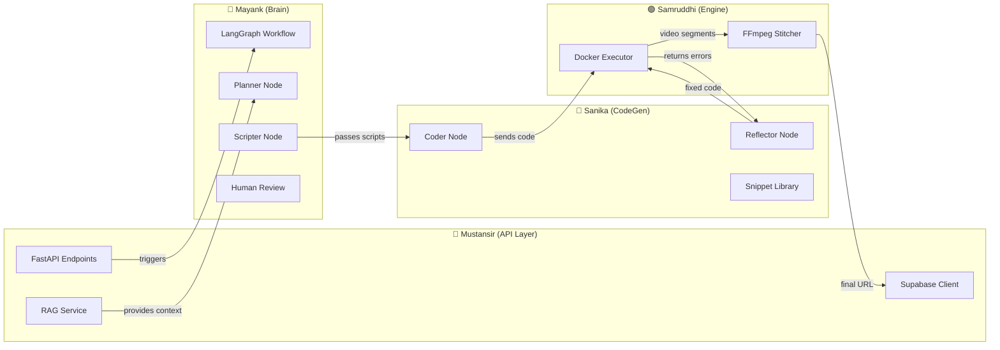

# Agentic Backend Implementation Guide

> **Team of 4 Parallel Work Plan** — Complete step-by-step guide for building the Agentic AI Educational Video Generation backend.

---

## Architecture Overview


The backend follows a **3-layer architecture**:

| Layer | Technology | Purpose |
|-------|-----------|---------|
| **API Layer** | FastAPI | HTTP endpoints, auth, file uploads |
| **Brain** | LangGraph | Agentic workflow orchestration |
| **Engine** | Docker + FFmpeg | Sandboxed Manim execution |

---

## Target Folder Structure

```
backend/
├── app/
│   ├── __init__.py
│   ├── main.py                    # FastAPI app entry point (Mustansir)
│   ├── config.py                  # Environment variables (Mustansir)
│   ├── api/
│   │   ├── __init__.py
│   │   ├── routes/
│   │   │   ├── __init__.py
│   │   │   ├── videos.py          # Video CRUD endpoints (Mustansir)
│   │   │   ├── upload.py          # PDF upload & RAG (Mustansir)
│   │   │   └── webhooks.py        # Human approval callbacks (Mustansir)
│   │   └── deps.py                # Dependency injection (Mustansir)
│   ├── services/
│   │   ├── __init__.py
│   │   ├── rag_service.py         # PDF parsing & vector search (Mustansir)
│   │   ├── supabase_client.py     # Supabase connection (Mustansir)
│   │   └── storage_service.py     # File upload/download (Mustansir)
│   ├── agents/
│   │   ├── __init__.py
│   │   ├── state.py               # AgentState TypedDict (Mayank)
│   │   ├── workflow.py            # LangGraph StateGraph (Mayank)
│   │   ├── nodes/
│   │   │   ├── __init__.py
│   │   │   ├── planner.py         # Planner Agent (Mayank)
│   │   │   ├── scripter.py        # Script Writer Agent (Mayank)
│   │   │   ├── human_review.py    # Interrupt/Resume logic (Mayank)
│   │   │   ├── coder.py           # Manim CodeGen Agent (Sanika)
│   │   │   └── reflector.py       # Self-correction Agent (Sanika)
│   │   └── prompts/
│   │       ├── __init__.py
│   │       ├── planner_prompts.py   # (Mayank)
│   │       ├── scripter_prompts.py  # (Mayank)
│   │       └── coder_prompts.py     # (Sanika)
│   ├── sandbox/
│   │   ├── __init__.py
│   │   ├── executor.py            # Docker execution logic (Samruddhi)
│   │   ├── renderer.py            # Manim render wrapper (Samruddhi)
│   │   └── stitcher.py            # FFmpeg video assembly (Samruddhi)
│   └── models/
│       ├── __init__.py
│       └── schemas.py             # Pydantic models (Mustansir)
├── docker/
│   ├── Dockerfile.sandbox         # Manim execution container (Samruddhi)
│   └── docker-compose.yml         # Local dev services (Samruddhi)
├── snippets/
│   └── manim_examples/            # Few-shot examples (Sanika)
│       ├── text_animation.py
│       ├── graph_drawing.py
│       ├── shape_transforms.py
│       └── README.md
├── tests/
│   └── ...                        # Unit tests (Everyone)
├── requirements.txt
├── .env.example
└── README.md
```

---

## Integration Map



---

## Role-Specific Action Plans

---

## 🔷 Mustansir (Team Lead & Architect)

**Focus:** FastAPI setup, Supabase integration, RAG/PDF parsing

### Phase 1: Project Setup (Day 1)

- [ ] **Step 1.1:** Initialize the backend project structure
  ```bash
  cd backend
  mkdir -p app/{api/routes,services,agents/nodes,agents/prompts,sandbox,models}
  mkdir -p docker snippets/manim_examples tests
  touch app/__init__.py app/main.py app/config.py
  ```

- [ ] **Step 1.2:** Create `requirements.txt`
  ```txt
  # Core
  fastapi==0.109.0
  uvicorn[standard]==0.27.0
  python-multipart==0.0.6
  pydantic==2.5.3
  pydantic-settings==2.1.0
  
  # Supabase & Database
  supabase==2.3.4
  vecs==0.4.3
  
  # LLM & Agents (Using OpenRouter/Groq for free models)
  langchain==0.1.4
  langgraph==0.0.26
  langchain-groq==0.0.3
  httpx==0.26.0  # For OpenRouter API calls
  tiktoken==0.5.2
  
  # PDF & RAG
  pypdf2==3.0.1
  langchain-community==0.0.16
  
  # Utilities
  python-dotenv==1.0.0
  httpx==0.26.0
  ```

- [ ] **Step 1.3:** Create `.env.example`
  ```env
  SUPABASE_URL=your_supabase_url
  SUPABASE_KEY=your_service_role_key
  
  # LLM Provider (choose one or both)
  GROQ_API_KEY=your_groq_key          # Free tier: llama-3.1-70b, mixtral-8x7b
  OPENROUTER_API_KEY=your_openrouter_key  # Free models available
  ```

- [ ] **Step 1.4:** Create `app/config.py`
  ```python
  # Logic:
  # - Use pydantic_settings to load env vars
  # - Export: SUPABASE_URL, SUPABASE_KEY, GROQ_API_KEY, OPENROUTER_API_KEY
  # - Create a Settings class with @lru_cache getter
  # - Add LLM_PROVIDER setting ("groq" or "openrouter")
  ```

### Phase 2: Supabase Integration (Day 1-2)

- [ ] **Step 2.1:** Run the SQL schema in Supabase SQL Editor
  > See `BackendPlan.md` lines 23-51 for the exact schema

- [ ] **Step 2.2:** Create `app/services/supabase_client.py`
  ```python
  # Logic:
  # - Initialize Supabase client with service role key
  # - Export get_supabase_client() function
  # - Add helper methods:
  #   - create_video(user_id, prompt, syllabus_path) -> video_id
  #   - update_video_status(video_id, status)
  #   - create_scene(video_id, order, narration, visual_plan)
  #   - update_scene_code(scene_id, manim_code)
  #   - mark_scene_rendered(scene_id, video_url)
  #   - log_scene_error(scene_id, error_log)
  ```

- [ ] **Step 2.3:** Create `app/models/schemas.py`
  ```python
  # Pydantic models:
  # - VideoCreate(prompt: str, syllabus_file: Optional[UploadFile])
  # - VideoResponse(id, status, created_at, final_video_url)
  # - SceneResponse(id, scene_order, narration_script, visual_plan, is_rendered)
  # - ApprovalRequest(video_id: str, approved: bool, feedback: Optional[str])
  ```

### Phase 3: RAG Service (Day 2-3)

- [ ] **Step 3.1:** Create `app/services/rag_service.py`
  ```python
  # Dependencies: pypdf2, langchain, supabase vecs
  
  # Functions to implement:
  
  # 1. parse_pdf(file_bytes) -> str
  #    - Use PyPDF2.PdfReader to extract text
  #    - Clean and normalize text
  
  # 2. chunk_text(text, chunk_size=500, overlap=50) -> List[str]
  #    - Use langchain's RecursiveCharacterTextSplitter
  
  # 3. store_embeddings(video_id, chunks) -> None
  #    - Generate embeddings with OpenAI text-embedding-ada-002
  #    - Store in Supabase pgvector table
  
  # 4. retrieve_context(query, video_id, top_k=5) -> str
  #    - Query pgvector for similar chunks
  #    - Return concatenated context string
  #    - THIS IS THE KEY FUNCTION FOR MAYANK'S AGENTS
  ```

### Phase 4: FastAPI Endpoints (Day 3-4)

- [ ] **Step 4.1:** Create `app/main.py`
  ```python
  # Logic:
  # - Create FastAPI app with CORS middleware
  # - Include routers from api/routes/
  # - Add health check endpoint
  ```

- [ ] **Step 4.2:** Create `app/api/routes/upload.py`
  ```python
  # POST /api/upload
  # - Accept PDF file + user_id
  # - Call parse_pdf() and store_embeddings()
  # - Return success status
  ```

- [ ] **Step 4.3:** Create `app/api/routes/videos.py`
  ```python
  # POST /api/videos
  # - Create new video request
  # - Trigger Mayank's workflow.start_workflow(video_id, prompt)
  # - Return video_id
  
  # GET /api/videos/{video_id}
  # - Return current status and scenes
  
  # GET /api/videos/{video_id}/scenes
  # - Return all scenes for review
  ```

- [ ] **Step 4.4:** Create `app/api/routes/webhooks.py`
  ```python
  # POST /api/videos/{video_id}/approve
  # - Accept ApprovalRequest
  # - If approved: resume Mayank's workflow
  # - If rejected: update status, store feedback
  ```

### Integration Points with Team

| Your Output | Connects To | How |
|-------------|-------------|-----|
| `retrieve_context()` | Mayank's Planner Node | Import and call in planner.py |
| `POST /api/videos` | Mayank's workflow.py | Call `start_workflow()` |
| `POST /api/approve` | Mayank's human_review.py | Call `resume_workflow()` |
| Supabase client | Everyone | Shared database access |

---

## 🔶 Mayank (The Director)

**Focus:** LangGraph setup, Prompt Engineering, Human-in-the-Loop

### Phase 1: Agent State & Workflow Setup (Day 1-2)

- [ ] **Step 1.1:** Create `app/agents/state.py`
  ```python
  from typing import TypedDict, List, Optional
  from typing_extensions import Annotated
  from langgraph.graph.message import add_messages
  
  class SceneScript(TypedDict):
      scene_order: int
      narration: str
      visual_description: str
      duration_estimate: int  # seconds
  
  class AgentState(TypedDict):
      # Input
      video_id: str
      user_prompt: str
      syllabus_context: str
      
      # Planning outputs
      topic_breakdown: List[str]  # High-level topics
      scene_plans: List[dict]     # Detailed scene structure
      
      # Script outputs
      scripts: List[SceneScript]
      
      # Human review
      user_approved: bool
      user_feedback: Optional[str]
      
      # Code generation
      current_scene_index: int
      generated_codes: List[str]
      
      # Execution
      last_render_error: Optional[str]
      retry_count: int
      all_scenes_done: bool
  ```

- [ ] **Step 1.2:** Create `app/agents/workflow.py` (skeleton)
  ```python
  from langgraph.graph import StateGraph, END
  from langgraph.checkpoint.memory import MemorySaver
  from .state import AgentState
  from .nodes import planner, scripter, human_review, coder
  
  def create_workflow():
      workflow = StateGraph(AgentState)
      
      # Add nodes (to be implemented)
      workflow.add_node("retrieve_info", retrieve_context_node)
      workflow.add_node("planner", planner.plan_scenes)
      workflow.add_node("scripter", scripter.write_scripts)
      workflow.add_node("human_review", human_review.wait_for_approval)
      workflow.add_node("coder", coder.generate_code)
      workflow.add_node("renderer", renderer.execute_and_check)
      
      # Define edges
      workflow.set_entry_point("retrieve_info")
      workflow.add_edge("retrieve_info", "planner")
      workflow.add_edge("planner", "scripter")
      workflow.add_edge("scripter", "human_review")
      workflow.add_edge("human_review", "coder")
      workflow.add_edge("coder", "renderer")
      
      # Conditional routing after render
      workflow.add_conditional_edges(
          "renderer",
          route_after_render,
          {
              "retry": "coder",      # Error occurred, retry
              "next_scene": "coder", # Move to next scene
              "complete": END        # All done
          }
      )
      
      # Compile with checkpointer for persistence
      memory = MemorySaver()
      return workflow.compile(
          checkpointer=memory,
          interrupt_before=["human_review"]  # CRITICAL for HITL
      )
  
  def route_after_render(state: AgentState) -> str:
      if state["last_render_error"] and state["retry_count"] < 3:
          return "retry"
      elif state["current_scene_index"] < len(state["scripts"]) - 1:
          return "next_scene"
      else:
          return "complete"
  ```

### Phase 2: Planner & Scripter Prompts (Day 2-3)

- [ ] **Step 2.1:** Create `app/agents/prompts/planner_prompts.py`
  ```python
  PLANNER_SYSTEM_PROMPT = """
  You are a curriculum expert and educational video planner.
  
  Given a topic and optional syllabus context, create a structured
  video plan with clear scenes.
  
  Requirements:
  - Each scene should be 30-90 seconds
  - Start with fundamentals, build complexity
  - Include visual demonstrations for each concept
  - Total video should be 3-5 minutes
  
  Output JSON format:
  {
      "title": "Video Title",
      "learning_objectives": ["objective1", "objective2"],
      "scenes": [
          {
              "scene_number": 1,
              "title": "Introduction to X",
              "key_concepts": ["concept1"],
              "visual_type": "text_animation|diagram|graph|equation",
              "duration_seconds": 60
          }
      ]
  }
  """
  
  def create_planner_prompt(user_prompt: str, context: str) -> str:
      return f"""
  User Request: {user_prompt}
  
  Syllabus Context:
  {context}
  
  Create a detailed video plan following the system instructions.
  """
  ```

- [ ] **Step 2.2:** Create `app/agents/prompts/scripter_prompts.py`
  ```python
  SCRIPTER_SYSTEM_PROMPT = """
  You are an educational script writer specializing in
  animated math/science videos.
  
  For each scene, write:
  1. NARRATION: What the narrator says (clear, engaging)
  2. VISUAL: Detailed description of what appears on screen
  
  Visual descriptions should be specific enough for Manim:
  - "Show the equation y = mx + b with each term appearing sequentially"
  - "Draw a right triangle, then animate the Pythagorean squares"
  
  Output JSON for each scene:
  {
      "scene_order": 1,
      "narration": "...",
      "visual_description": "...",
      "duration_estimate": 60
  }
  """
  ```

### Phase 3: Planner & Scripter Nodes (Day 3-4)

- [ ] **Step 3.1:** Create `app/agents/nodes/planner.py`
  ```python
  from langchain_groq import ChatGroq  # or use OpenRouter via httpx
  from ..state import AgentState
  from ..prompts.planner_prompts import PLANNER_SYSTEM_PROMPT, create_planner_prompt
  
  async def plan_scenes(state: AgentState) -> AgentState:
      """
      Logic:
      1. Get LLM (Groq: llama-3.1-70b-versatile or mixtral-8x7b-32768)
      2. Create prompt with user request + RAG context
      3. Call LLM with JSON mode
      4. Parse response into scene_plans
      5. Update state with scene_plans
      6. Save to Supabase (optional, for persistence)
      """
      # Using Groq's free tier - fast and capable
      llm = ChatGroq(
          model="llama-3.1-70b-versatile",  # or "mixtral-8x7b-32768"
          temperature=0.7
      )
      
      prompt = create_planner_prompt(
          state["user_prompt"],
          state["syllabus_context"]
      )
      
      response = await llm.ainvoke([
          {"role": "system", "content": PLANNER_SYSTEM_PROMPT},
          {"role": "user", "content": prompt}
      ])
      
      # Parse JSON from response
      plan = parse_json_response(response.content)
      
      return {
          **state,
          "topic_breakdown": plan["learning_objectives"],
          "scene_plans": plan["scenes"]
      }
  ```

- [ ] **Step 3.2:** Create `app/agents/nodes/scripter.py`
  ```python
  async def write_scripts(state: AgentState) -> AgentState:
      """
      Logic:
      1. Iterate through scene_plans
      2. For each scene, call LLM to generate script
      3. Build list of SceneScript objects
      4. Save scripts to Supabase scenes table
      5. Update video status to 'waiting_approval'
      """
      scripts = []
      for scene_plan in state["scene_plans"]:
          script = await generate_scene_script(scene_plan)
          scripts.append(script)
          # Save to DB
          await supabase.create_scene(
              state["video_id"],
              script["scene_order"],
              script["narration"],
              script["visual_description"]
          )
      
      await supabase.update_video_status(state["video_id"], "waiting_approval")
      
      return {**state, "scripts": scripts}
  ```

### Phase 4: Human-in-the-Loop (Day 4)

- [ ] **Step 4.1:** Create `app/agents/nodes/human_review.py`
  ```python
  async def wait_for_approval(state: AgentState) -> AgentState:
      """
      This node is an INTERRUPT point.
      
      When LangGraph hits this node with interrupt_before,
      execution pauses and state is saved.
      
      The frontend polls GET /api/videos/{id} and sees
      status='waiting_approval'.
      
      User reviews scripts in dashboard.
      
      When user clicks Approve/Reject:
      - POST /api/videos/{id}/approve is called
      - This resumes the graph with updated state
      
      Logic in this node:
      1. If user_approved=True: continue to coder
      2. If user_approved=False: 
         - Store feedback
         - Could route back to scripter (advanced)
         - For MVP: just mark failed
      """
      if not state["user_approved"]:
          # Handle rejection - for MVP, just log
          return {
              **state,
              "current_scene_index": 0,
              "all_scenes_done": False
          }
      
      return {
          **state,
          "current_scene_index": 0,
          "generated_codes": [],
          "retry_count": 0
      }
  ```

- [ ] **Step 4.2:** Create workflow control functions
  ```python
  # In workflow.py - add these helper functions
  
  # Store active workflows in memory (or Redis for production)
  active_workflows = {}
  
  async def start_workflow(video_id: str, prompt: str, context: str):
      """Called by Mustansir's POST /api/videos endpoint"""
      workflow = create_workflow()
      config = {"configurable": {"thread_id": video_id}}
      
      initial_state = {
          "video_id": video_id,
          "user_prompt": prompt,
          "syllabus_context": context,
          "user_approved": False,
          "scripts": [],
          # ... other initial values
      }
      
      # This will run until it hits interrupt_before=["human_review"]
      result = await workflow.ainvoke(initial_state, config)
      active_workflows[video_id] = (workflow, config)
      return result
  
  async def resume_workflow(video_id: str, approved: bool, feedback: str = None):
      """Called by Mustansir's POST /api/approve endpoint"""
      workflow, config = active_workflows[video_id]
      
      # Update the state with approval
      await workflow.aupdate_state(
          config,
          {"user_approved": approved, "user_feedback": feedback}
      )
      
      # Resume execution
      result = await workflow.ainvoke(None, config)
      return result
  ```

### Integration Points with Team

| Your Output | Connects To | How |
|-------------|-------------|-----|
| `AgentState` | Sanika's coder.py | Shared state structure |
| `scripts` in state | Sanika's coder node | Input for code generation |
| `start_workflow()` | Mustansir's API | Called from POST /api/videos |
| `resume_workflow()` | Mustansir's API | Called from POST /api/approve |

---

## 🔴 Sanika (The Animator)

**Focus:** Code Generation Agent, Self-Correction, Manim Snippet Library

### Phase 1: Manim Snippet Library (Day 1-2)

- [ ] **Step 1.1:** Create `snippets/manim_examples/README.md`
  ```markdown
  # Manim Code Snippets for Few-Shot Prompting
  
  These examples are fed to the CodeGen agent to improve output quality.
  Each file demonstrates a specific animation pattern.
  ```

- [ ] **Step 1.2:** Create `snippets/manim_examples/text_animation.py`
  ```python
  """
  Example: Text appearing and transforming
  Use case: Introducing concepts, showing definitions
  """
  from manim import *
  
  class TextIntro(Scene):
      def construct(self):
          # Title appears
          title = Text("Pythagorean Theorem", font_size=48)
          self.play(Write(title))
          self.wait(1)
          
          # Transform to equation
          equation = MathTex("a^2 + b^2 = c^2")
          self.play(Transform(title, equation))
          self.wait(2)
  ```

- [ ] **Step 1.3:** Create `snippets/manim_examples/graph_drawing.py`
  ```python
  """
  Example: Drawing mathematical graphs
  Use case: Functions, data visualization
  """
  from manim import *
  
  class GraphExample(Scene):
      def construct(self):
          axes = Axes(
              x_range=[-3, 3],
              y_range=[-2, 2],
              axis_config={"include_tip": True}
          )
          graph = axes.plot(lambda x: x**2, color=BLUE)
          label = axes.get_graph_label(graph, label="x^2")
          
          self.play(Create(axes))
          self.play(Create(graph), Write(label))
          self.wait(2)
  ```

- [ ] **Step 1.4:** Create additional examples for:
  - `shape_transforms.py` — Geometric shape animations
  - `equation_steps.py` — Step-by-step equation solving
  - `diagram_build.py` — Building diagrams piece by piece

### Phase 2: CodeGen Prompts (Day 2-3)

- [ ] **Step 2.1:** Create `app/agents/prompts/coder_prompts.py`
  ```python
  CODER_SYSTEM_PROMPT = """
  You are a Manim code expert. Generate Python code using the Manim library
  to create educational animations.
  
  RULES:
  1. Always use a Scene class with construct() method
  2. Use self.play() for animations, self.wait() for pauses
  3. Import only from manim: `from manim import *`
  4. Keep animations smooth - use appropriate run_time
  5. End each major section with self.wait(1)
  
  COMMON PATTERNS:
  - Text: Text("content", font_size=36)
  - Math: MathTex("latex_equation")
  - Shapes: Circle(), Square(), Triangle()
  - Arrows: Arrow(start, end)
  - Groups: VGroup(obj1, obj2)
  
  ANIMATION METHODS:
  - Write(text) - for text appearing
  - Create(shape) - for shapes appearing
  - Transform(a, b) - morph a into b
  - FadeIn/FadeOut - opacity transitions
  - MoveTo(position) - move objects
  
  OUTPUT FORMAT:
  Return ONLY valid Python code. No markdown, no explanations.
  Start with imports, define one Scene class.
  """
  
  # Load examples from snippets folder
  def get_few_shot_examples() -> str:
      """Load all examples from snippets/manim_examples/"""
      examples = []
      for file in Path("snippets/manim_examples").glob("*.py"):
          content = file.read_text()
          examples.append(f"# Example: {file.stem}\n{content}")
      return "\n\n".join(examples)
  
  def create_coder_prompt(visual_description: str, narration: str) -> str:
      examples = get_few_shot_examples()
      return f"""
  EXAMPLES OF GOOD MANIM CODE:
  {examples}
  
  ---
  
  SCENE TO ANIMATE:
  Visual Description: {visual_description}
  Narration (for timing reference): {narration}
  
  Generate the Manim code for this scene.
  """
  ```

### Phase 3: CodeGen Node (Day 3-4)

- [ ] **Step 3.1:** Create `app/agents/nodes/coder.py`
  ```python
  from langchain_openai import ChatOpenAI
  from ..state import AgentState
  from ..prompts.coder_prompts import CODER_SYSTEM_PROMPT, create_coder_prompt
  
  async def generate_code(state: AgentState) -> AgentState:
      """
      Logic:
      1. Get current scene from scripts[current_scene_index]
      2. Check if we're in retry mode (last_render_error exists)
      3. If retry: use reflector logic instead
      4. If normal: generate fresh code
      5. Update state with generated code
      6. Save code to Supabase scene record
      """
      scene_index = state["current_scene_index"]
      scene = state["scripts"][scene_index]
      
      # Check if this is a retry
      if state["last_render_error"]:
          return await reflect_and_fix(state)
      
      # Using Groq's free tier for code generation
      llm = ChatGroq(
          model="llama-3.1-70b-versatile",
          temperature=0.2  # Lower temp for code
      )
      
      prompt = create_coder_prompt(
          scene["visual_description"],
          scene["narration"]
      )
      
      response = await llm.ainvoke([
          {"role": "system", "content": CODER_SYSTEM_PROMPT},
          {"role": "user", "content": prompt}
      ])
      
      code = clean_code_response(response.content)
      
      # Update Supabase
      scene_id = await get_scene_id(state["video_id"], scene_index)
      await supabase.update_scene_code(scene_id, code)
      
      # Update state
      new_codes = state["generated_codes"] + [code]
      return {
          **state,
          "generated_codes": new_codes,
          "last_render_error": None
      }
  
  def clean_code_response(response: str) -> str:
      """Remove markdown code blocks if present"""
      if response.startswith("```python"):
          response = response[9:]
      if response.startswith("```"):
          response = response[3:]
      if response.endswith("```"):
          response = response[:-3]
      return response.strip()
  ```

### Phase 4: Reflector (Self-Correction) Node (Day 4)

- [ ] **Step 4.1:** Create `app/agents/nodes/reflector.py`
  ```python
  REFLECTOR_SYSTEM_PROMPT = """
  You are debugging Manim code that failed to execute.
  
  Analyze the error and fix the code.
  
  COMMON ERRORS AND FIXES:
  1. NameError: Check imports are correct
  2. AttributeError: Verify Manim method names
  3. TypeError: Check argument types and counts
  4. "No Scene found": Ensure class inherits from Scene
  5. Positioning errors: Use proper coordinate tuples
  
  OUTPUT: Return ONLY the fixed Python code.
  """
  
  async def reflect_and_fix(state: AgentState) -> AgentState:
      """
      Logic:
      1. Get the broken code from generated_codes
      2. Get the error message from last_render_error
      3. Ask LLM to analyze and fix
      4. Increment retry_count
      5. Return fixed code in state
      """
      scene_index = state["current_scene_index"]
      broken_code = state["generated_codes"][scene_index]
      error = state["last_render_error"]
      
      llm = ChatGroq(model="llama-3.1-70b-versatile", temperature=0.1)
      
      prompt = f"""
  BROKEN CODE:
  ```python
  {broken_code}
  ```
  
  ERROR MESSAGE:
  {error}
  
  Fix the code to resolve this error.
  """
      
      response = await llm.ainvoke([
          {"role": "system", "content": REFLECTOR_SYSTEM_PROMPT},
          {"role": "user", "content": prompt}
      ])
      
      fixed_code = clean_code_response(response.content)
      
      # Update the code in list
      new_codes = state["generated_codes"].copy()
      new_codes[scene_index] = fixed_code
      
      return {
          **state,
          "generated_codes": new_codes,
          "retry_count": state["retry_count"] + 1,
          "last_render_error": None  # Clear error for fresh render
      }
  ```

### Integration Points with Team

| Your Output | Connects To | How |
|-------------|-------------|-----|
| `generated_codes` | Samruddhi's executor | Code strings passed to Docker |
| Expects `last_render_error` | From Samruddhi's executor | Error feedback loop |
| Uses `scripts` | From Mayank's scripter | Input visual descriptions |
| Snippet library | Self (prompts) | Few-shot examples in prompts |

---

## 🟢 Samruddhi (The Engineer)

**Focus:** Docker Sandbox, FFmpeg Stitching, File Management

### Phase 1: Docker Sandbox Setup (Day 1-2)

- [ ] **Step 1.1:** Create `docker/Dockerfile.sandbox`
  ```dockerfile
  FROM python:3.10-slim
  
  # Install system dependencies for Manim
  RUN apt-get update && apt-get install -y \
      ffmpeg \
      libcairo2-dev \
      libpango1.0-dev \
      texlive-full \
      && rm -rf /var/lib/apt/lists/*
  
  # Install Manim
  RUN pip install manim==0.18.0
  
  # Create working directory
  WORKDIR /render
  
  # Configure for 480p low quality (fast rendering)
  ENV MANIM_QUALITY=low_quality
  
  # The container expects:
  # - Code file mounted at /render/scene.py
  # - Output written to /render/media/
  
  # Default command renders at 480p15 (low quality, fast)
  CMD ["manim", "render", "-ql", "scene.py"]
  ```

- [ ] **Step 1.2:** Create `docker/docker-compose.yml`
  ```yaml
  version: '3.8'
  
  services:
    # Redis for task queue (optional, for scaling)
    redis:
      image: redis:alpine
      ports:
        - "6379:6379"
    
    # The main API (built separately)
    api:
      build:
        context: ../
        dockerfile: Dockerfile
      ports:
        - "8000:8000"
      environment:
        - REDIS_URL=redis://redis:6379
      volumes:
        - ../storage:/app/storage  # Shared storage for videos
      depends_on:
        - redis
  ```

- [ ] **Step 1.3:** Test the sandbox manually
  ```bash
  # Build the sandbox image
  docker build -t manim-sandbox -f docker/Dockerfile.sandbox .
  
  # Create a test file
  echo '
  from manim import *
  class TestScene(Scene):
      def construct(self):
          self.play(Write(Text("Hello Manim!")))
  ' > test_scene.py
  
  # Run it
  docker run --rm -v $(pwd):/render manim-sandbox
  
  # Check output exists
  ls media/videos/scene/720p30/
  ```

### Phase 2: Executor Service (Day 2-3)

- [ ] **Step 2.1:** Create `app/sandbox/executor.py`
  ```python
  import subprocess
  import tempfile
  import os
  from pathlib import Path
  
  class ManimExecutor:
      """
      Executes Manim code in a Docker sandbox.
      Returns success/failure with output or error message.
      """
      
      def __init__(self, storage_path: str = "/app/storage"):
          self.storage_path = Path(storage_path)
          self.storage_path.mkdir(exist_ok=True)
      
      async def execute(
          self, 
          code: str, 
          video_id: str, 
          scene_index: int
      ) -> dict:
          """
          Logic:
          1. Create temp directory for this render
          2. Write code to scene.py file
          3. Run Docker container with volume mount
          4. Capture stdout and stderr
          5. If success: return video file path
          6. If failure: return error message
          """
          render_dir = self.storage_path / video_id / f"scene_{scene_index}"
          render_dir.mkdir(parents=True, exist_ok=True)
          
          # Write code file
          code_file = render_dir / "scene.py"
          code_file.write_text(code)
          
          # Run Docker
          result = subprocess.run(
              [
                  "docker", "run", "--rm",
                  "-v", f"{render_dir}:/render",
                  "--memory=512m",      # Limit memory
                  "--cpus=1",           # Limit CPU
                  "--network=none",     # No network access (security)
                  "manim-sandbox"
              ],
              capture_output=True,
              text=True,
              timeout=120  # 2 minute timeout
          )
          
          if result.returncode == 0:
              # Find the output video
              video_files = list((render_dir / "media" / "videos").rglob("*.mp4"))
              if video_files:
                  return {
                      "success": True,
                      "video_path": str(video_files[0]),
                      "stdout": result.stdout
                  }
          
          return {
              "success": False,
              "error": result.stderr,
              "stdout": result.stdout
          }
  ```

### Phase 3: Renderer Node (Day 3)

- [ ] **Step 3.1:** Create `app/sandbox/renderer.py`
  ```python
  from .executor import ManimExecutor
  from app.agents.state import AgentState
  from app.services.supabase_client import supabase
  
  executor = ManimExecutor()
  
  async def execute_and_check(state: AgentState) -> AgentState:
      """
      This node is called by Mayank's workflow after coder node.
      
      Logic:
      1. Get current code from generated_codes[current_scene_index]
      2. Call executor.execute()
      3. If success:
         - Upload video segment to Supabase Storage
         - Mark scene as rendered in DB
         - Move to next scene
      4. If failure:
         - Store error in state.last_render_error
         - Return for Sanika's reflector to fix
      """
      scene_index = state["current_scene_index"]
      code = state["generated_codes"][scene_index]
      
      result = await executor.execute(
          code, 
          state["video_id"], 
          scene_index
      )
      
      if result["success"]:
          # Upload to Supabase Storage
          video_url = await upload_to_storage(
              result["video_path"],
              state["video_id"],
              scene_index
          )
          
          # Update database
          scene_id = await get_scene_id(state["video_id"], scene_index)
          await supabase.mark_scene_rendered(scene_id, video_url)
          
          # Check if all scenes done
          all_done = scene_index >= len(state["scripts"]) - 1
          
          return {
              **state,
              "current_scene_index": scene_index + 1 if not all_done else scene_index,
              "all_scenes_done": all_done,
              "last_render_error": None
          }
      
      else:
          # Store error for reflector
          scene_id = await get_scene_id(state["video_id"], scene_index)
          await supabase.log_scene_error(scene_id, result["error"])
          
          return {
              **state,
              "last_render_error": result["error"]
          }
  ```

### Phase 4: Video Stitcher (Day 4)

- [ ] **Step 4.1:** Create `app/sandbox/stitcher.py`
  ```python
  import subprocess
  from pathlib import Path
  from app.services.supabase_client import supabase
  
  class VideoStitcher:
      """
      Combines all scene videos into final output using FFmpeg.
      """
      
      async def stitch_videos(self, video_id: str) -> str:
          """
          Logic:
          1. Query DB for all scene video URLs
          2. Download all segments to temp folder
          3. Create FFmpeg concat file
          4. Run FFmpeg to merge
          5. Upload final video to Supabase Storage
          6. Update video record with final_video_url
          7. Return final URL
          """
          # Get all scene videos from DB
          scenes = await supabase.get_scenes(video_id)
          segment_paths = []
          
          work_dir = Path(f"/app/storage/{video_id}/final")
          work_dir.mkdir(exist_ok=True)
          
          # Download all segments
          for scene in scenes:
              if scene["video_segment_url"]:
                  local_path = work_dir / f"scene_{scene['scene_order']}.mp4"
                  await download_file(scene["video_segment_url"], local_path)
                  segment_paths.append(local_path)
          
          # Create concat file for FFmpeg
          concat_file = work_dir / "concat.txt"
          with open(concat_file, "w") as f:
              for path in segment_paths:
                  f.write(f"file '{path}'\n")
          
          # Run FFmpeg
          output_path = work_dir / "final_video.mp4"
          subprocess.run([
              "ffmpeg", "-y",
              "-f", "concat",
              "-safe", "0",
              "-i", str(concat_file),
              "-c", "copy",
              str(output_path)
          ], check=True)
          
          # Upload to Supabase Storage
          final_url = await upload_final_video(output_path, video_id)
          
          # Update DB
          await supabase.client.table("videos").update({
              "final_video_url": final_url,
              "status": "completed"
          }).eq("id", video_id).execute()
          
          return final_url
  ```

- [ ] **Step 4.2:** Add stitching trigger to workflow
  ```python
  # In workflow.py, add final node
  
  async def finalize_video(state: AgentState) -> AgentState:
      """Called when all_scenes_done is True"""
      stitcher = VideoStitcher()
      final_url = await stitcher.stitch_videos(state["video_id"])
      return {**state, "final_video_url": final_url}
  
  # Add to workflow before END
  workflow.add_node("finalize", finalize_video)
  workflow.add_edge("finalize", END)
  
  # Update conditional routing
  def route_after_render(state):
      if state["last_render_error"] and state["retry_count"] < 3:
          return "retry"
      elif not state["all_scenes_done"]:
          return "next_scene"
      else:
          return "finalize"  # Changed from "complete" to "finalize"
  ```

### Integration Points with Team

| Your Output | Connects To | How |
|-------------|-------------|-----|
| `execute_and_check` node | Mayank's workflow | Node in StateGraph |
| Error output | Sanika's reflector | `last_render_error` in state |
| Final video URL | Mustansir's API | Stored in Supabase |
| Docker image | Everyone | Shared sandbox environment |

---

## Daily Standup Checklist

### Day 1 Sync Points
- [ ] **Mustansir:** Share `.env` variables with team
- [ ] **Samruddhi:** Confirm Docker sandbox builds successfully
- [ ] **Everyone:** Run `pip install -r requirements.txt`

### Day 2 Sync Points
- [ ] **Mustansir → Mayank:** `retrieve_context()` function ready
- [ ] **Sanika:** Share snippet library in repo

### Day 3 Sync Points
- [ ] **Mayank → Mustansir:** `start_workflow()` and `resume_workflow()` signatures agreed
- [ ] **Sanika ↔ Samruddhi:** Test coder output with executor

### Day 4 Sync Points
- [ ] **Full integration test:** Submit prompt → Get video
- [ ] **Everyone:** Document any remaining bugs

---

## Testing Checklist

### Unit Tests (Each Member)
- [ ] Mustansir: Test `parse_pdf()`, `retrieve_context()`
- [ ] Mayank: Test `plan_scenes()`, `write_scripts()` (mock LLM)
- [ ] Sanika: Test `generate_code()`, `reflect_and_fix()` (mock LLM)
- [ ] Samruddhi: Test `execute()` with simple Manim code

### Integration Tests (Together)
```bash
# 1. Start services
docker-compose up -d

# 2. Run API
uvicorn app.main:app --reload

# 3. Test flow
curl -X POST http://localhost:8000/api/videos \
  -H "Content-Type: application/json" \
  -d '{"prompt": "Explain the Pythagorean theorem"}'

# 4. Check status
curl http://localhost:8000/api/videos/{video_id}

# 5. Approve scripts (when status = waiting_approval)
curl -X POST http://localhost:8000/api/videos/{video_id}/approve \
  -d '{"approved": true}'

# 6. Wait and check final video
curl http://localhost:8000/api/videos/{video_id}
# Should have final_video_url
```

---

## Troubleshooting Guide

| Issue | Likely Cause | Fix |
|-------|--------------|-----|
| Docker build fails | Missing deps | Check Docker Desktop running, rebuild |
| LangGraph interrupt not working | Wrong LangGraph version | Ensure `langgraph>=0.0.26` |
| Manim code fails | Bad LLM output | Check snippet examples, improve prompt |
| Supabase connection fails | Wrong keys | Verify `.env` has service_role key |
| FFmpeg concat fails | Different codecs | Re-encode segments before concat |

---

## Success Criteria

✅ User can submit a prompt via API
✅ Planner generates scene breakdown
✅ Scripter writes narration + visuals
✅ Dashboard shows scripts for approval
✅ User approves → CodeGen starts
✅ Manim code executes in Docker
✅ Failed code triggers self-correction (max 3 retries)
✅ All scenes render → FFmpeg stitches
✅ Final video URL returned to user
