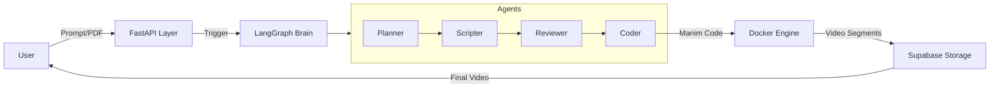

# 🎬 Manima

**Agentic AI for Curriculum-Aligned Educational Video Generation**

Manima is a web application that enables educators to generate curriculum-aligned educational videos from simple text prompts or uploaded study materials (PDFs). It uses a sophisticated **Agentic AI** pipeline powered by **LangGraph** to orchestrate multiple specialized agents that plan, script, code, and review animations using **Manim**.

---

## 🚀 Overview

The platform automates the creation of high-quality educational content by simulating a production studio:
- **Planner Agent:** Breaks down topics into structured learning segments.
- **Script Agent:** Writes clear, engaging narration and visual descriptions.
- **CodeGen Agent:** Generates Python code for **Manim** animations.
- **Reviewer Agent:** Validates code and ensures quality.
- **Engine:** Executes code in a sandboxed Docker environment to render videos.

---

## 🧩 Tech Stack

### 🧠 AI & Brain
- **LangGraph**: For stateful, multi-agent orchestration.
- **LangChain**: For LLM interactions.
- **LLMs**: LLaMA 3.1 70B / Mistral 8x7B (via Groq/OpenRouter).
- **RAG**: Supabase Vector (pgvector) + local embeddings.

### ⚙️ Backend (The Engine)
- **FastAPI**: REST API for orchestration and job management.
- **Python 3.10+**: Core language.
- **Manim**: Mathematical Animation Engine.
- **Docker**: Sandboxed execution environment for rendering.
- **FFmpeg**: Video stitching and post-processing.
- **Supabase**: Database (PostgreSQL) and Storage.

### 🖥️ Frontend
- **Next.js**: React framework for the UI.
- **Tailwind CSS**: Styling and responsive design.
- **Supabase Auth**: User authentication.

---

## 🏗️ Architecture

The backend follows a **3-layer architecture**:



---

## 🛠️ Project Setup

For a detailed, step-by-step setup guide for Mac and Windows, please refer to [SETUP.md](./SETUP.md).

### Quick Start (Mac/Linux)

**1. Prerequisites**
- Node.js & pnpm
- Python 3.10+
- Docker Desktop
- Supabase CLI

**2. Clone the Repo**
```bash
git clone https://github.com/mustansirr/manima.git
cd manima
```

**3. Start Database**
```bash
supabase start
```

**4. Frontend Setup**
```bash
cd frontend
pnpm install
# Configure .env.local with Supabase URL & Anon Key
pnpm dev
```

**5. Backend Setup**
```bash
cd backend
python -m venv venv
source venv/bin/activate
pip install -r requirements.txt
# Configure .env with Supabase URL & Service Role Key
uvicorn main:app --reload
```

---

## 👥 Team

- **Mustansir Rangwala** — Team Lead & Architect (API Layer, Supabase, RAG)
- **Mayank Salunkhe** — The Director (LangGraph Workflow, Planner/Scripter Agents)
- **Samruddhi Kadam** — The Engine (Docker execution, Rendering, FFmpeg)
- **Sanika Shinde** — The Animator (CodeGen Agent, Manim Snippets, Self-Correction)

---

## 🧾 License

This project is open-source under the **MIT License**.
