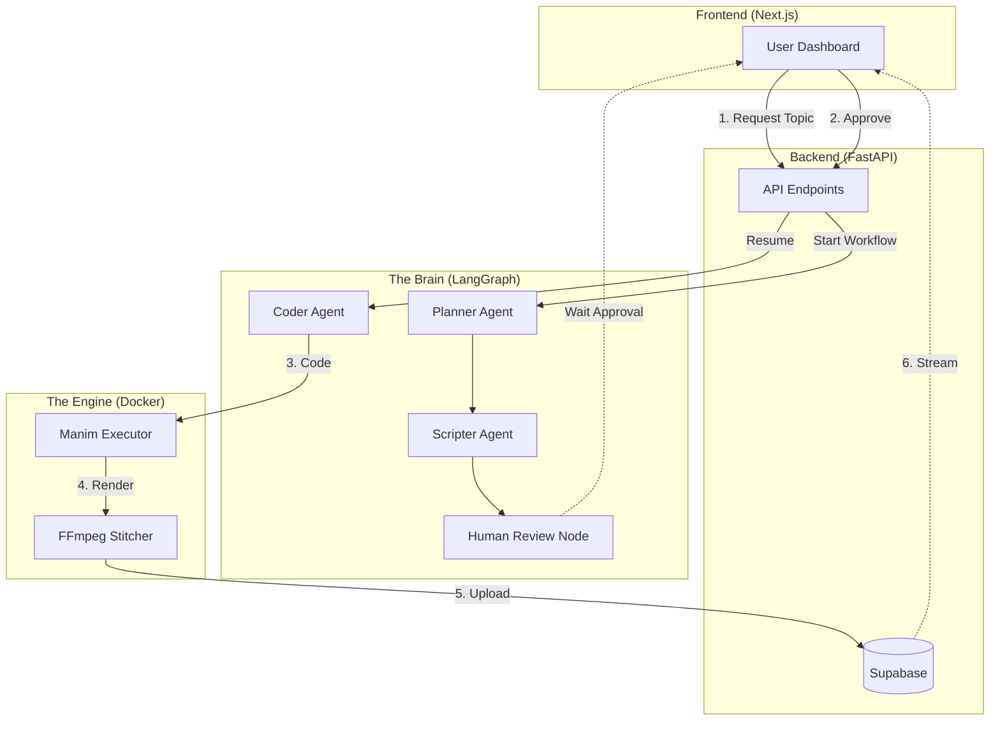

# Project Implementation & Workflow Overview

This document explains **what we built**, **how it works**, and **the tools used**. Use this as a reference for your presentation to the professor.

---

## 🚀 1. High-Level Workflow (The "Script-to-Video" Pipeline)

Our system turns a prompt (e.g., "Explain the Pythagorean Theorem") into a fully animated educational video. Here is the step-by-step lifecycle of a request:

1.  **User Request**: The user enters a topic and optionally uploads a syllabus PDF on the frontend.
2.  **Planning (The Brain)**: The AI analyzes the request (and syllabus) to create a structured lesson plan with scene breakdowns.
3.  **Scripting**: The AI writes a detailed narration script and visual descriptions for each scene.
4.  **Human-in-the-Loop Review**: The workflow **pauses** and waits for the user to approve the scripts on the dashboard.
5.  **Code Generation**: Once approved, the AI interacts with a "Snippet Library" to generate runnable Python code (`manim` library) for each scene.
6.  **Sandboxed Execution**: The backend spins up a secure Docker container to run the Python code and render the animation.
7.  **Stitching**: Individual scene videos are stitched together into a final MP4 and returned to the user.

---

## 🏗️ 2. System Architecture

The following diagram illustrates how the Frontend, Backend, AI Agents, and Video Rendering Engine interact:



---

## 🛠️ 3. Tech Stack & Tools

We used a modern, 3-layer architecture to ensure scalability and security.

### 🅰️ Frontend (The Dashboard)
*   **Framework**: [Next.js 16](https://nextjs.org/) (React) - For a fast, server-rendered UI.
*   **Styling**: [Tailwind CSS v4](https://tailwindcss.com/) - For rapid, maintaining styling.
*   **Components**: [Radix UI](https://www.radix-ui.com/) - For accessible, unstyled UI primitives (dialogs, dropdowns).
*   **State**: [TanStack Query](https://tanstack.com/query) (implied via standard patterns) or native `useEffect` for API polling.

### 🅱️ Backend API (The Controller)
*   **Framework**: [FastAPI](https://fastapi.tiangolo.com/) - High-performance Python web framework.
*   **Database**: [Supabase](https://supabase.com/) (PostgreSQL) - Stores users, video metadata, and scenes.
*   **Storage**: Supabase Storage - Stores generated video files (`.mp4`) and uploaded PDFs.
*   **Vector DB**: `pgvector` (via Supabase) - Used for RAG (Retrieval Augmented Generation) to search syllabus documents.

### 🧠 The "Brain" (AI Orchestration)
*   **Orchestrator**: [LangGraph](https://langchain-ai.github.io/langgraph/) - Manages the complex state machine (Planner -> Scripter -> Review -> Coder).
*   **LLMs**: [Groq](https://groq.com/) (Llama 3, Mixtral) - Ultra-fast inference for real-time planning and scripting.
*   **RAG**: [LangChain](https://www.langchain.com/) + `pypdf2` - Parses uploaded PDFs to give the AI context about the curriculum.

### ⚙️ The "Engine" (Video Generation)
*   **Animation Library**: [Manim](https://www.manim.community/) - The math animation engine used by 3Blue1Brown.
*   **Sandboxing**: [Docker](https://www.docker.com/) - **Crucial for security**. We run user-generated Python code inside an isolated container with no network access (`network=none`), limited CPU (`--cpus=1`), and limited memory (`512MB`).
*   **Processing**: `ffmpeg` - Used to stitch independent scene clips into the final video.

---

## 🔍 4. Key Implementation Details (For Questions)

If the professor asks "How did you handle X?", here are the answers based on your codebase:

### Q: "How do you ensure the AI generates valid code?"
**A:** We use a **Self-Correction Loop**.
1.  The `Coder` agent generates code based on our "Snippet Library" (few-shot examples).
2.  We allow the code to fail. If `manim` creates an error, a `Reflector` agent reads the error message and tries to fix the code automatically (up to 3 retries).

### Q: "Is it safe to run AI-generated code?"
**A:** Yes, we implemented **Sandboxing**.
Check `backend/app/sandbox/executor.py`. We execute code using `docker run` with strict limits. The container is ephemeral (`--rm`), has no internet access, and processes are killed if they run too long (`timeout=120s`).

### Q: "How does the Human Review work?"
**A:** We utilize **LangGraph's "Interrupt" feature**.
The workflow graph is defined with `interrupt_before=["human_review"]`. This physically stops the execution process and saves the state to memory. The backend waits for a `POST /approve` API call from the frontend before resuming.

### Q: "How do you handle long video generation times?"
**A:** The system is **Asynchronous**.
The frontend polls the `GET /videos/{id}` endpoint to check status (`planning`, `waiting_approval`, `rendering`, `completed`). This prevents the browser from freezing while the backend works.

---

## 📂 5. Project Structure Overview

```text
root/
├── frontend/             # Next.js Dashboard
├── backend/
│   ├── app/
│   │   ├── api/          # FastAPI Endpoints
│   │   ├── agents/       # LangGraph Workflow & Nodes
│   │   │   ├── workflow.py   # Main StateGraph definition
│   │   │   ├── nodes/        # Individual agents (Planner, Coder, etc.)
│   │   │   └── prompts/      # System prompts for LLMs
│   │   └── sandbox/      # Docker Execution Logic
│   ├── docker/           # Dockerfiles for Manim
│   └── requirements.txt  # Python Depenedencies
└── docker-compose.yml    # Development Orchestration
```
