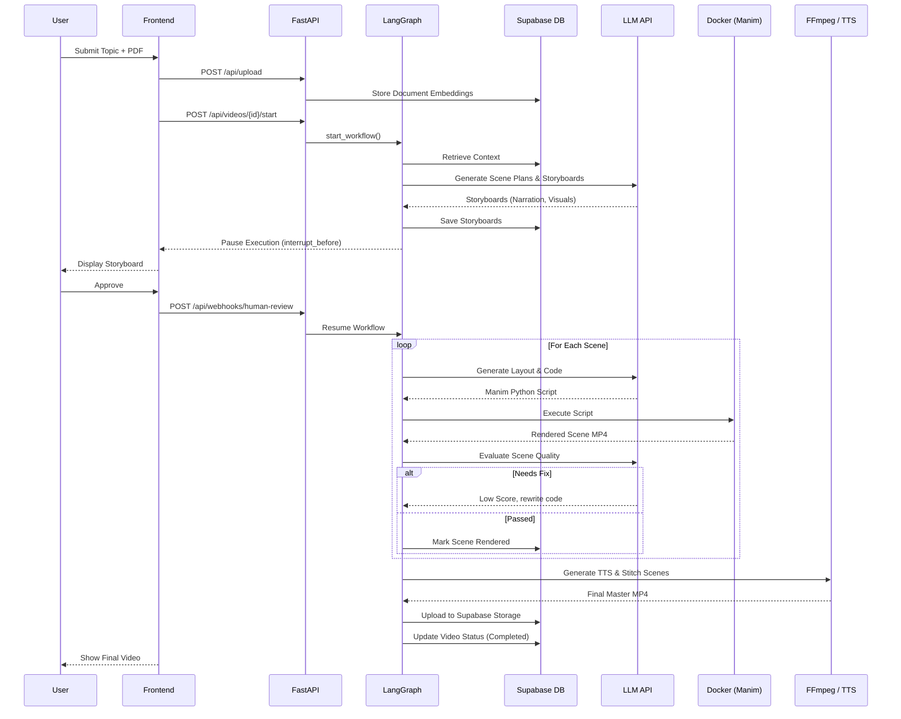

# End-to-End Video Generation Pipeline

This document describes the complete pipeline of the **Manima** platform, tracking how a user's prompt and optional PDF document are transformed into a final rendered curriculum-aligned educational video. 

---

## 1. High-Level Overview

The Manima platform automates the entire video production studio process using Agentic AI. 

1. **Input Submission:** The user submits a prompt (e.g., "Explain Pythagorean Theorem") and optionally uploads a PDF syllabus via the Next.js frontend.
2. **Context & Orchestration:** The FastAPI backend parses the PDF, stores vector embeddings in Supabase for RAG (Retrieval-Augmented Generation), and triggers a LangGraph-orchestrated workflow.
3. **Planning & Scripting:** Specialized AI agents break down the topic into a structured series of scenes, deciding the visualization strategy, narration, and visual storyboard.
4. **Human Review:** The workflow automatically pauses, sending the storyboard to the frontend for user approval.
5. **Code Generation:** Once approved, agents translate the visual concepts into declarative JSON, validate it, compute screen layouts, and write Python code for the **Manim** animation engine.
6. **Execution & Evaluation:** The Python code is executed securely inside a Docker sandbox. The rendered scene videos are evaluated by an AI critic for quality and educational clarity. Failures automatically trigger a self-correction loop.
7. **Finalization:** After all scenes render successfully, `edge-tts` generates voiceover audio, and `FFmpeg` merges the video, audio, and generated subtitles. All scenes are concatenated into a final master video and uploaded to Supabase Storage.

---

## 2. Step-by-Step Execution Flow

### Stage 1: Context Ingestion (RAG)
- **Purpose:** Parse user-provided PDFs so agents can align the video content with specific curriculum requirements.
- **Input:** User PDF file and video ID.
- **Processing:** Extract text from PDF, chunk it, generate vector embeddings, and store them in Supabase `pgvector`.
- **Output:** Stored document chunks ready for semantic search.
- **Important Files:** `backend/app/api/routes/upload.py`, `backend/app/services/rag_service.py`

### Stage 2: Planning & Storyboarding
- **Purpose:** Structure the video's content before writing code.
- **Input:** User prompt and RAG context.
- **Processing:** The LangGraph workflow starts. The `Planner` creates learning objectives and a scene-by-scene breakdown. The `Concept Classifier` determines visual metaphors. The `Storyboard` agent drafts narration and visual descriptions.
- **Output:** A structured list of scenes (`storyboards` in `AgentState`).
- **Important Files:** `backend/app/agents/nodes/planner.py`, `backend/app/agents/nodes/storyboard_agent.py`

### Stage 3: Human Review
- **Purpose:** Ensure the content meets the user's expectations before expending expensive compute resources to render video.
- **Input:** Storyboards in the state.
- **Processing:** LangGraph workflow pauses (`interrupt_before=["human_review"]`). The frontend polls the database/API and displays the storyboard. User clicks "Approve".
- **Output:** `user_approved: True` injected into the state, resuming the workflow.
- **Important Files:** `backend/app/api/routes/videos.py` (`start` endpoint), `backend/app/agents/workflow.py`

### Stage 4: Layout & Code Generation
- **Purpose:** Translate the approved storyboard into executable animation code.
- **Input:** Approved storyboard scenes.
- **Processing:** 
  1. `scene_json` converts the narrative into declarative JSON components.
  2. A rigorous pre-render validation pipeline ensures schema validity, domain accuracy, and educational clarity.
  3. `layout` computes spatial coordinates.
  4. `coder` writes Manim Python code to animate the components.
- **Output:** Python Manim code strings (`generated_codes`).
- **Important Files:** `backend/app/agents/nodes/layout_agent.py`, `backend/app/agents/nodes/coder.py`

### Stage 5: Sandbox Rendering & Quality Assurance
- **Purpose:** Safely execute AI-generated code to produce MP4 video files and evaluate their quality.
- **Input:** Manim Python code.
- **Processing:**
  1. `static_analyzer` checks the code for unsafe imports or basic syntax errors.
  2. `renderer` passes the code to `ManimExecutor`, which mounts it into a Docker container running the Manim environment.
  3. The rendered MP4 is uploaded to Supabase Storage.
  4. Evaluators score the video. If the score is low or render fails, `fix_agent` or `reflector` rewrites the code (up to 3 retries).
- **Output:** Rendered MP4 segment URLs stored in `AgentState` and the database.
- **Important Files:** `backend/app/sandbox/renderer.py`, `backend/app/sandbox/executor.py`

### Stage 6: Audio, Subtitles, and Stitching (Finalization)
- **Purpose:** Combine silent animation segments with AI voiceover and captions into one cohesive video.
- **Input:** Rendered silent MP4 segments and narration text.
- **Processing:**
  1. `edge-tts` is invoked to synthesize audio (TTS) and generate VTT subtitles from the narration script.
  2. `FFmpeg` merges the silent video segment, the TTS audio track, and hardcodes the subtitles onto the video.
  3. All merged scenes are concatenated via `FFmpeg` into a `final_video.mp4` with consistent encoding.
- **Output:** A final MP4 video uploaded to Supabase Storage.
- **Important Files:** `backend/app/sandbox/stitcher.py`, `backend/app/sandbox/subtitles.py`

---

## 3. Detailed Pipeline

The pipeline spans multiple distributed and local services:

1. **Next.js Frontend:** Provides the UI for uploading PDFs, inputting prompts, reviewing storyboards, and watching the final video.
2. **FastAPI Backend:** Exposes REST endpoints (`/api/upload`, `/api/videos`) to manage data and initiate processes.
3. **RAG Service & Supabase Vector:** Stores chunked syllabus data for semantic retrieval.
4. **LangGraph Orchestration:** Defines a state machine (`StateGraph`) connecting all specialized AI agents.
5. **Planner, Script, & Code Agents:** Sequential LLM calls (via LangChain to LLaMA 3.1 / Mistral) to generate content.
6. **Docker Sandbox:** Isolates the execution of generated Python code to protect the host environment.
7. **Python & Manim:** The target environment and library used to mathematically define and render animations.
8. **Edge TTS:** A CLI tool invoked via subprocess to generate realistic voiceovers from the narration text.
9. **FFmpeg Stitching:** Manipulates media files, overlaying subtitles (`filter_complex`), mixing audio, and concatenating segments safely.
10. **Supabase Storage:** Hosts the intermediate scene files and the final output video for frontend streaming.

---

## 4. Data Flow

The following describes how the primary data structure mutates throughout the generation lifecycle:

1. **User Prompt & File** → JSON Request / Multipart Form
2. **Upload Endpoint** → `Supabase pgvector` (Text Chunks & Embeddings)
3. **Workflow Start** → `AgentState` initialized with `video_id` and `user_prompt`
4. **Planner Agent** → `AgentState["scene_plans"]` (List of abstract scene structures)
5. **Storyboard Agent** → `AgentState["storyboards"]` (Detailed narration and visual instructions)
6. **Human Review** → `AgentState["user_approved"]` (Boolean flag to proceed)
7. **JSON/Layout Agents** → `AgentState["positioned_jsons"]` (Declarative JSON with computed (x,y) screen coordinates)
8. **Code Agent** → `AgentState["generated_codes"]` (Raw Python Manim script strings)
9. **Docker/Manim Environment** → Local MP4 File on host volume
10. **Renderer Node** → Uploads local MP4, returns `Supabase Storage URL`
11. **Evaluator Nodes** → `AgentState["quality_scores"]` (Dict of numerical scores determining if a retry edge is taken)
12. **Stitcher (Finalize Node)** → Downloads MP4s, generates audio `.mp3` and `.vtt`, outputs merged local `final.mp4`
13. **Upload** → Final `Supabase Storage URL` (Video available to frontend)

---

## 5. Important Files

| File | Responsibility |
|------|----------------|
| `backend/app/main.py` | FastAPI application initialization and CORS configuration. |
| `backend/app/api/routes/videos.py` | API for creating video records and starting the LangGraph workflow. |
| `backend/app/agents/workflow.py` | The LangGraph `StateGraph` definition and edge routing logic. |
| `backend/app/agents/state.py` | Defines `AgentState`, the `TypedDict` carrying data between nodes. |
| `backend/app/sandbox/executor.py` | `ManimExecutor` class handling Docker container lifecycles to run Manim code. |
| `backend/app/sandbox/renderer.py` | The LangGraph node that wraps the executor and uploads segments. |
| `backend/app/sandbox/stitcher.py` | Manages `edge-tts` and `FFmpeg` subprocesses to add audio/captions and concatenate videos. |
| `backend/app/services/rag_service.py` | Handles PDF parsing, chunking, and embedding generation. |

---

## 6. External Libraries

- **LangGraph & LangChain**: Used in `backend/app/agents/` to build the multi-agent state machine and interface with LLMs.
- **FastAPI**: Used in `backend/app/api/` to provide the HTTP REST interface.
- **Supabase SDKs**: Used across frontend and backend for Auth, Database (`pgvector`), and Storage buckets.
- **Docker SDK for Python**: Used in `executor.py` to programmatically spin up sandboxed Manim containers.
- **Manim**: A Python mathematical animation engine installed *inside* the Docker container, invoked by the generated code.
- **Edge TTS**: Invoked as a CLI tool (`edge-tts`) via `subprocess` in `stitcher.py` to create narration MP3s and VTT subtitles.
- **FFmpeg**: Invoked as a CLI tool via `subprocess` in `stitcher.py` to merge audio/video, burn-in subtitles, and concatenate MP4s.

---

## 7. Mermaid Diagram

```mermaid
flowchart TD
    User([User]) -->|Prompt & PDF| Frontend(Next.js Frontend)
    Frontend -->|Upload File| API_Upload[FastAPI: /api/upload]
    Frontend -->|Create & Start| API_Videos[FastAPI: /api/videos]

    API_Upload -->|Chunk & Embed| RAG(Supabase pgvector)
    
    API_Videos -->|Init AgentState| Graph(LangGraph Orchestrator)
    
    subgraph "LangGraph AI Workflow"
        Graph --> Retrieve[Context Retriever]
        Retrieve --> Planner[Planner Agent]
        Planner --> Storyboard[Storyboard Agent]
        
        Storyboard -.->|Pause / Wait| Review{Human Review}
        
        Review -- "Approved" --> PreRender(JSON & Layout Agents)
        PreRender --> CodeGen[Code Generation Agent]
        
        CodeGen --> Static[Static Analyzer]
        Static --> RenderNode(Renderer Node)
        
        RenderNode --> Eval[Quality Evaluators]
        Eval -- "Fail (Score < 8)" --> Fix[Fix / Reflector Agent]
        Fix --> CodeGen
        
        Eval -- "Pass" --> NextScene{More Scenes?}
        NextScene -- "Yes" --> PreRender
        NextScene -- "No" --> Finalize[Finalize / Stitcher Node]
    end
    
    subgraph "Execution Sandbox"
        RenderNode -->|Run Python| Docker[Docker Container]
        Docker -->|Render| Manim[Manim Engine]
        Manim -->|Output MP4| RenderNode
    end
    
    subgraph "Media Processing (Stitcher)"
        Finalize --> TTS[edge-tts (Audio & Subs)]
        TTS --> FFmpeg[FFmpeg (Merge & Concat)]
    end
    
    RenderNode -.->|Upload Segment| SupabaseStorage[(Supabase Storage)]
    FFmpeg -.->|Upload Final.mp4| SupabaseStorage
    SupabaseStorage -->|Stream URL| Frontend
    Review -.->|Poll/Approve| Frontend
```

---

## 8. Sequence Diagram



---

## 9. Notes

- **Modularity:** The LangGraph implementation divides concerns very cleanly. Planning, layout calculation, and code generation are separated. Pre-render validators (`schema_validator`, `domain_validator`, etc.) ensure the logical JSON representation is flawless before generating complex Python code, saving API costs and compute time.
- **Docker Security:** Manim execution is entirely isolated in a Docker container via `executor.py` (`docker run --rm ...`). This prevents arbitrary code execution vulnerabilities, as LLMs frequently hallucinate malicious or unsafe system calls.
- **Audio & Subtitle Sync:** `subtitles.py` and `stitcher.py` demonstrate a clever lightweight approach to A/V sync. The `edge-tts` tool generates both the audio voiceover and a `.vtt` file from the text script. FFmpeg is then used with a `filter_complex` command to dynamically burn the subtitles onto the video while mixing the audio track.
- **Robustness in Concat:** In `stitcher.py`, FFmpeg concat is performed using re-encoding (`-c:v libx264`) rather than standard `-c copy` stream copying. While slower, this guarantees that differences in individual scene rendering (e.g., slight frame rate or codec parameter mismatches) do not corrupt the final assembled file.
