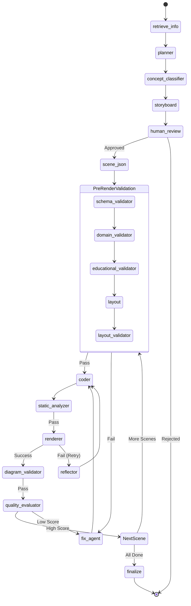

# LangGraph Architecture

This document provides a comprehensive technical overview of the **LangGraph** implementation used in the Manima project to orchestrate the multi-agent video generation workflow.

---

## 1. High-Level Overview

**LangGraph** is a library for building stateful, multi-actor applications with LLMs. In Manima, it serves as the central brain and orchestrator of the entire video generation pipeline.

**Responsibilities handled by LangGraph:**
- **State Management:** Maintains a shared, strongly-typed state object (`AgentState`) that flows through every node, accumulating context, scripts, code, and errors.
- **Agent Orchestration:** Routes execution between specialized AI agents (Planner, Scripter, JSON Generator, Vision Critic, etc.) and deterministic functions (Sandbox Renderer, Validators).
- **Human-in-the-loop (HITL):** Natively pauses execution to allow humans to review and approve the storyboard before expensive compute/rendering is consumed.
- **Cyclic Execution & Auto-Correction:** Enables loops within the graph. If code execution fails or a vision model gives a low quality score, the graph routes back to a reflector/fix agent to rewrite the code and retry.

---

## 2. Graph Structure

The graph is defined as a `StateGraph` in `app/agents/workflow.py`.

- **Entry Point:** `retrieve_info`

### Nodes
1. **`retrieve_info`**: Retrieves syllabus context via RAG.
2. **`planner`**: Breaks down the topic into a scene-by-scene plan.
3. **`concept_classifier`**: Determines the visual metaphor/strategy.
4. **`storyboard`**: Writes narration and visual descriptions.
5. **`human_review`**: A dummy node where the graph pauses (`interrupt_before`).
6. **`scene_json`**: Generates a declarative semantic JSON representation.
7. **`schema_validator`**, **`domain_validator`**, **`educational_validator`**, **`layout_validator`**: Pre-render validation pipeline.
8. **`layout`**: Computes spatial coordinates deterministically.
9. **`coder`**: Generates Manim Python code deterministically from JSON.
10. **`static_analyzer`**: Analyzes generated code before execution.
11. **`renderer`**: Executes the code in the Docker sandbox.
12. **`diagram_validator`**: Checks if the rendered frame represents the requested diagram.
13. **`quality_evaluator`**: Grades the rendered video using a Vision LLM.
14. **`fix_agent`** & **`reflector`**: Fixes logic/code errors and retry.
15. **`finalize`**: Stitches all videos together using FFmpeg and TTS.

### Edges & Conditional Routing
- Linear edges connect initial prep: `retrieve_info` → `planner`, `concept_classifier` → `storyboard` → `human_review`.
- **`route_after_pre_render_validation`**: Used extensively after validators and the planner. Routes to the next node on `"pass"`, to the `fix_agent` on `"fail"`, or `END` on `"fatal"`.
- **`route_after_review`**: Checks `user_approved`. Routes to `scene_json` if true, `END` if rejected.
- **`route_after_render`**: Checks for execution errors. Routes to `reflector` for retry, `diagram_validator` on success, or `finalize` if all scenes are done.
- **`route_after_eval`**: Checks the `quality_scores`. If any score < 8 (and retries < 3), routes to `fix_agent`. Otherwise routes to `coder` for the next scene, or `finalize`.

**Execution Order:**
Data Prep → Planning → Pause/Review → Loop Start [JSON → Validate → Code → Sandbox → Evaluate → (Fix/Retry if needed)] → Loop End → Finalize.

---

## 3. State Object

The shared state is defined as `AgentState` (`TypedDict`) in `app/agents/state.py`.

| Field | Type | Purpose | Writer Node | Reader Node(s) |
|-------|------|---------|-------------|----------------|
| `video_id` | `str` | Database UUID | Init | Almost all |
| `user_prompt` | `str` | Original user request | Init | planner |
| `syllabus_context` | `str` | RAG PDF text | retrieve_info | planner |
| `concept_topic` | `str` | High-level topic | concept_classifier | storyboard |
| `visualization_strategy` | `str` | Type of visual required | concept_classifier | scene_json |
| `video_title` | `str` | Generated title | planner | storyboard |
| `topic_breakdown` | `List[str]` | Key concepts | planner | storyboard |
| `scene_plans` | `List[ScenePlan]` | Scene outlines | planner | storyboard |
| `storyboards` | `List[StoryboardScene]` | Narrations/visuals | storyboard | scene_json, eval |
| `user_approved` | `bool` | Human review flag | Webhook API | conditional edge |
| `user_feedback` | `str` | Human feedback text | Webhook API | scene_json |
| `scene_jsons` | `List[SceneJSON]` | Declarative scene spec | scene_json | validators, layout |
| `positioned_jsons` | `List[PositionedJSON]` | Spec + coordinates | layout | coder |
| `current_scene_index` | `int` | Loop counter | renderer, coder | coder, renderer, eval |
| `generated_codes` | `List[str]` | Manim python scripts | coder | renderer |
| `last_render_error` | `str` | Python/Sandbox error | renderer, analyzers | reflector, fix_agent |
| `last_rendered_video_path` | `str` | Local MP4 path | renderer | eval, finalize |
| `retry_count` | `int` | Loop limiter | renderer, fix_agent | conditional edges |
| `all_scenes_done` | `bool` | End-of-loop flag | renderer | conditional edges |
| `quality_scores` | `QualityScores` | Vision LLM grades | quality_evaluator | conditional edges |

---

## 4. Node Documentation

### 4.1. `planner` (Planner Agent)
- **Purpose:** Creates a structured multi-scene educational plan from a prompt/syllabus.
- **Inputs:** `user_prompt`, `syllabus_context`.
- **Outputs:** `video_title`, `topic_breakdown`, `scene_plans`.
- **Files:** `nodes/planner.py`, `prompts/planner_prompts.py`
- **Model:** LLM configured via `llm_factory.py` ("planner" role, default Groq Llama-3.3-70b-versatile).

### 4.2. `storyboard` (Storyboard Agent)
- **Purpose:** Fleshes out scene plans with precise narration scripts and visual descriptions.
- **Inputs:** `scene_plans`.
- **Outputs:** `storyboards`.
- **Files:** `nodes/storyboard_agent.py`.

### 4.3. `scene_json` (Scene JSON Generator)
- **Purpose:** Converts narrative storyboards into structured `SceneJSON` enforcing allowed components (e.g., `GraphPlot`, `FlowChart`).
- **Inputs:** `storyboards`, `visualization_strategy`.
- **Outputs:** `scene_jsons`.
- **Model:** LLM configured as "scripter" role.

### 4.4. `coder` (Manim Generator)
- **Purpose:** Deterministically generates Manim Python code from the semantic `positioned_jsons`. *(Note: This node no longer uses an LLM to write code directly, ensuring high reliability)*.
- **Inputs:** `positioned_jsons`, `current_scene_index`.
- **Outputs:** `generated_codes`.
- **Files:** `nodes/coder.py`.

### 4.5. `renderer` (Execution Sandbox)
- **Purpose:** Executes generated Python code inside a Docker container using `ManimExecutor` and uploads the result to Supabase Storage.
- **Inputs:** `generated_codes`, `current_scene_index`.
- **Outputs:** `last_rendered_video_path`, `last_render_error`, `all_scenes_done`.
- **Files:** `app/sandbox/renderer.py`, `app/sandbox/executor.py`.

### 4.6. `quality_evaluator` (Vision Critic)
- **Purpose:** Grades the final frame of the rendered video on visual clarity, educational clarity, and layout quality.
- **Inputs:** `last_rendered_video_path`, `storyboards`.
- **Outputs:** `quality_scores`.
- **Files:** `nodes/video_quality_evaluator.py`.
- **Model:** `meta-llama/llama-4-scout-17b-16e-instruct` via ChatGroq.

---

## 5. Execution Flow

1. **Start:** `start_workflow()` is called, initializing `AgentState`.
2. **Context:** `retrieve_context_node` fetches RAG text.
3. **Plan:** `planner` dictates the structure.
4. **Draft:** `concept_classifier` and `storyboard` draft the content.
5. **Wait:** Graph reaches `wait_for_approval` and suspends state to PostgreSQL via LangGraph's `MemorySaver` checkpointing.
6. **Resume:** API calls `resume_workflow()` updating `user_approved`.
7. **Semantic Translation:** `scene_json` builds `SceneJSON`.
8. **Loop over scenes:**
   - Pre-render validators (`schema_validator` → `domain` → `educational` → `layout`).
   - `coder` translates to Python.
   - `static_analyzer` checks syntax.
   - `renderer` spins up Docker, runs Manim, and outputs MP4.
   - `diagram_validator` & `quality_evaluator` grade the MP4.
   - If grades are low, route to `fix_agent`, increment `retry_count`, loop back to `coder`.
   - If success, increment `current_scene_index` and loop to next scene.
9. **Stitch:** When `all_scenes_done == True`, `finalize_video` calls `edge-tts` and `FFmpeg` to produce the final MP4.
10. **End:** Workflow hits `END`.

---

## 6. Error Handling

- **Validation Failures:** Pre-render validators can short-circuit the execution. If a fatal error occurs (e.g., missing API keys, rate limits), it sets `last_render_error` containing `"FATAL ERROR"` which forces the conditional edge to route to `END`.
- **Sandbox Failures:** If Docker Manim execution fails, `renderer` captures `stderr` and populates `last_render_error`. The routing edge directs execution to `reflector`.
- **Retries:** Loop paths are strictly limited by the `retry_count` state variable. `route_after_render` and `route_after_eval` check if `retry_count < 3`. If exhausted, the workflow skips the failing scene or proceeds to avoid infinite loops.
- **Fallback Models:** `llm_factory.py` implements an automatic fallback mechanism. If the primary provider (Groq) throws a 429 Rate Limit error, the factory sleeps and automatically switches to OpenRouter's free Llama tier to ensure continuity.

---

## 7. Graph Visualization

### LangGraph State Machine

---

## 8. File Structure

| Path | Responsibility |
|------|----------------|
| `backend/app/agents/workflow.py` | Graph builder, node wiring, and conditional edge routing logic. |
| `backend/app/agents/state.py` | Definition of `AgentState` and initial state creation logic. |
| `backend/app/agents/nodes/` | Directory containing all individual LangGraph node functions. |
| `backend/app/agents/prompts/` | System prompts and prompt formatting functions for LLM agents. |
| `backend/app/services/llm_factory.py` | Instantiates `BaseChatModel` based on environment variables/roles. |

---

## 9. Dependencies

- **LangGraph** & **LangChain**: Core orchestration and LLM abstraction layers.
- **Supabase SDK**: Used inside nodes (like `renderer` and `planner`) to sync state progress back to the database in real-time.
- **Tiktoken**: Used inside `planner.py` to dynamically estimate token counts and truncate context to avoid context-window overflows.
- **Pydantic**: Heavily utilized for Structured Outputs when LLMs are asked to generate JSON blueprints.

---

## 10. Notes

- **Separation of LLM and Determinism:** A significant architectural choice is that the `coder` node does *not* utilize an LLM. Previous iterations likely did, but currently, LLMs stop at generating `SceneJSON` specifications. The `coder` node deterministically maps these JSON specs to Manim objects. This drastically reduces hallucinated syntax errors and improves reliability.
- **Development Bypass:** Conditional edges (like `route_after_pre_render_validation`) contain a `DEVELOPMENT_MODE` toggle that forces the graph to bypass certain fatal validation errors to keep the pipeline moving during testing.
- **State Checkpointing:** The workflow uses LangGraph's `MemorySaver()` checkpointer. This is strictly required to enable the `interrupt_before=["human_review"]` functionality, allowing the process state to persist in memory (or database in production) while waiting for user interaction.
