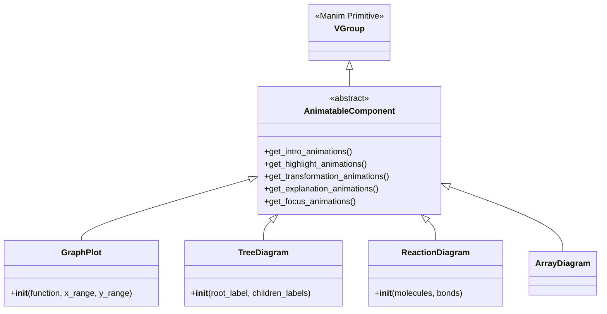
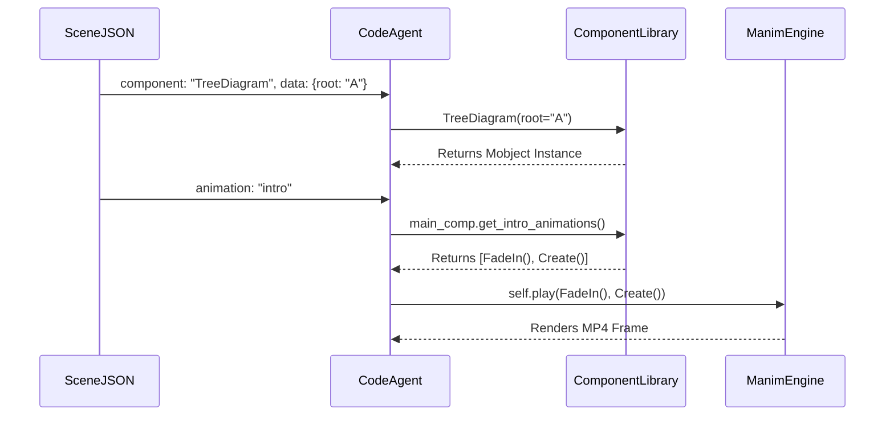

# Component Library Architecture

This document details the architecture, capabilities, and API of the Manim Component Library (`app/sandbox/components.py`), which powers the deterministic rendering system in the Manima platform.

---

## 1. High-Level Overview

The **Component Library** is a custom abstraction layer built on top of the Manim animation engine.

- **Purpose:** It provides a safe, deterministic set of educational building blocks. Instead of the LLM trying to correctly write raw Manim geometric primitives (`Circle`, `ArcBetweenPoints`, `MathTex`) and placing them using coordinate math, the LLM requests a high-level component (e.g., `GraphPlot(function="x**2")`). 
- **Problem Solved:** Eradicates hallucinated Manim syntax errors, prevents object overlapping, and guarantees a consistent visual style across all videos.
- **Interactions:** 
  - **SceneJSON:** Defines *which* component to use and the `component_data` values.
  - **Layout Agent:** Wraps the component inside abstract `LayoutZones` to automatically scale and center it to fit the 16:9 camera frame without manual coordinate math.
  - **Code Agent:** Instantiates the component by translating SceneJSON into a python string: `main_comp = ComponentName(**component_data)`.
  - **Renderer:** Executes the generated file using the Manim Docker sandbox.

---

## 2. Library Structure

The library uses a highly object-oriented approach leveraging Manim's `VGroup`.

- **Base Class (`AnimatableComponent`):** Inherits from Manim's `VGroup`. It defines the five required abstract animation interfaces (`get_intro_animations`, etc.) with safe default behaviors (like `FadeIn` or `Indicate`).
- **Styling Utility (`VisualGrammar`):** A static class defining strict color palettes (`primary`, `secondary`, `accent`), spacing rules, and maximum object counts to prevent scene clutter.
- **Helper Classes (`SmartText`, `LayoutZones`):**
  - `SmartText`: Automatically detects if a string should be rendered as plain `Text` or mathematical `MathTex` based on the domain context (e.g., using `STEM_BLUEPRINTS`).
- **Sanitization Function:** `filter_manim_kwargs(kwargs)` strips out any hallucinated arguments passed by the LLM, allowing only safe Manim style keys (`color`, `opacity`) to reach the `VGroup` constructor.
- **Registries:** Defined in `shared_animation_registry.py`. Ensures the Code Agent only ever attempts to instantiate known, safe classes.

---

## 3. Complete Component Catalogue

The library currently supports 32 distinct educational components spanning multiple STEM domains.

### General & Structural
- **TitleCard**: Standard title and subtitle block.
- **SummaryDiagram**: Bulleted list of key takeaways.
- **TimelineDiagram**: Chronological sequence on a number line.
- **NumberLineDiagram**: Standard 1D mathematical axis.

### Computer Science
- **FlowChart**: Connected sequence of rectangular nodes.
- **GraphDiagram**: Circular arrangement of nodes and edges.
- **TreeDiagram**: Hierarchical top-down branching nodes.
- **ArrayDiagram**: Contiguous memory blocks with indices.
- **BinarySearchDiagram**: Array with specific low, mid, high pointers.
- **NetworkDiagram**: Multi-layer perceptron style node-and-edge layout.
- **NeuralNetworkDiagram**: Bespoke dense neural network visualizer.

### Mathematics
- **GraphPlot**: 2D Cartesian plane with safe `eval()` function plotting.
- **FunctionPlot**: Variant of GraphPlot customized for calculus functions.
- **GeometryDiagram**: Shapes (triangle, square, circle) with labels.
- **RightTriangleDiagram**: Pythagorean theorem visualizer with angle markers.
- **AreaProofDiagram**: Visual proof of $(a+b)^2$ using subdivided squares.
- **MatrixDisplay**: Mathematical matrix bracket renderer.
- **VectorArrow**: 2D vector on a coordinate plane.
- **CoordinateGeometryDiagram**: Points and lines plotted on an axis.
- **BarChartDiagram**: Standard data visualization chart.
- **GradientDescentPlot**: Parabola with iterative step-down animation.

### Physics
- **ParticleDiagram**: Interacting particles with force vectors.
- **ForceVectorDiagram**: Free-body diagram with labeled force arrows.
- **ElectricFieldDiagram**: Positive/Negative charges with electric field lines.
- **WaveDiagram**: Sine wave with amplitude and wavelength markers.
- **SurfaceTensionDiagram**: Water surface with bulk and surface molecule interaction forces.
- **LiquidSurfaceDiagram**: Alternative fluid surface representation.
- **DropletDiagram**: Circular droplet showing inward surface tension forces.

### Chemistry
- **MoleculeDiagram**: Atoms connected by bonds.
- **AtomDiagram**: Bohr model with nucleus and orbiting electrons.
- **ReactionDiagram**: Reactants yielding products with transformation support.

---

## 4. Component API

All components share a strictly enforced API contract.

**Constructor Signature:**
`def __init__(self, **kwargs)`
Components extract their specific semantic data from `kwargs` (e.g., `function` for `GraphPlot`, `elements` for `ArrayDiagram`). They must handle missing data gracefully using defaults, as LLMs may omit fields.

**Inheritance:**
Every component inherits from `AnimatableComponent` (which inherits from `manim.VGroup`).

**Internal State:**
During `__init__`, components instantiate raw Manim primitives (`Square`, `Circle`, `Line`) and add them to themselves using `self.add()`.

**Return Types:**
Components are Mobjects. They do not "return" anything; they are drawn to the screen by the Manim scene.

---

## 5. Animation Capabilities

To bridge the gap between semantic JSON intents and Manim animation primitives, the library enforces exactly **five standard animation intents**. 

Every component must implement (or inherit) the following methods, returning a list of Manim `Animation` objects:

1. **`get_intro_animations(self)`**: How the object appears.
   - *ArrayDiagram*: `[FadeIn(cells)]`
   - *ReactionDiagram*: `[FadeIn(reactants, shift=RIGHT), GrowArrow(yield_arrow), FadeIn(products, shift=LEFT)]`
2. **`get_highlight_animations(self)`**: How to draw attention to the main body.
   - *Most components*: `[Indicate(self)]`
3. **`get_transformation_animations(self)`**: How the object fundamentally changes.
   - *AtomDiagram*: `[MoveAlongPath(electrons, orbits)]`
   - *ReactionDiagram*: `[Transform(reactants.copy(), products)]`
4. **`get_explanation_animations(self)`**: How to draw attention to relationships/connective tissue.
   - *TreeDiagram*: `[Indicate(edges)]`
   - *ElectricFieldDiagram*: `[Indicate(force_vectors)]`
5. **`get_focus_animations(self)`**: How to emphasize a specific critical sub-element.
   - *Most components*: `[Circumscribe(core_element)]` or `[Flash(center)]`

*(Note: Validation occurs at the bottom of `components.py` via `validate_animation_interfaces()`, ensuring no component breaks this contract).*

---

## 6. Internal State

**Components do NOT maintain dynamic, cross-scene internal state.**

- They are instantiated fresh for every single scene.
- They cannot inherently "compare two states" (e.g., you cannot pass two arrays and ask Manim to animate the difference automatically). 
- To animate a state transition (like sorting an array), the user must either use the predefined `get_transformation_animations()` or the SceneJSON must redraw the component with new `component_data` in the next scene. 
- *Exception:* Specific components (like `ReactionDiagram`) hardcode specific `Transform()` primitives between two VGroups created within the same single scene block.

---

## 7. Visual Quality

The visual capabilities leverage Manim's modern vector graphics engine:
- **Smooth Animation:** 60fps vector interpolation.
- **Color Consistency:** Enforced by `VisualGrammar.colors` (Primary: Yellow, Secondary: Blue, Accent: Green).
- **Responsive Layouts:** The `LayoutZones` class dynamically calculates bounding boxes. If a component exceeds a width of 13.0 or a height of 7.0, it automatically scales down using `scale_to_fit_width/height` to remain within the 16:9 camera bounds.
- **Smart Formatting:** The `SmartText` class parses whether a string requires MathTex rendering (LaTeX equations) or standard Text rendering, heavily reducing formatting errors.

*(What it lacks: True 3D projection, advanced CSS-like grid layouts, and complex gradient fills).*

---

## 8. Extensibility

To add a new component to the platform:

1. **Required File:** Add the class to `app/sandbox/components.py`.
2. **Inheritance:** Class must inherit from `AnimatableComponent`.
3. **Required Methods:** Must implement the constructor and, optionally, override the 5 `get_*_animations()` methods for custom behavior.
4. **Registration:** Add the exact string name of the class to the `SUPPORTED_COMPONENTS` set inside `app/sandbox/shared_animation_registry.py`.
5. **Validation:** The `validate_animation_interfaces()` function will automatically verify the new class upon module load. Once in the registry, the LLM is permitted to request it via SceneJSON.

---

## 9. Relationships with SceneJSON

The `component_data` dict from SceneJSON is passed directly as Python `**kwargs` into the component constructor.

- **Flexibility:** It is highly flexible. The component constructor signature absorbs arbitrary fields. 
- **Unknown Parameters:** The `filter_manim_kwargs` function ensures that if the LLM hallucinates random geometry parameters (`radius=50`, `stroke_opacity=X`), they are stripped out before hitting the `VGroup` super constructor, preventing fatal `TypeError` crashes.
- **Resilience:** All components utilize robust `kwargs.get("key", default_value)` patterns to ensure rendering never fails even if the LLM provides an empty data payload.

---

## 10. Limitations

- **No 3D Support:** The library currently only supports 2D `VGroup` compositions.
- **Rigid Animation Paths:** Animations are limited to 5 high-level intents. You cannot instruct the `GraphPlot` to zoom specifically into coordinate (3, 4) via SceneJSON.
- **Stateless Transitions:** Because scenes are completely independent, smooth continuous morphing of an object from Scene 1 to Scene 2 is structurally impossible.
- **Sub-Element Targeting:** The LLM cannot easily instruct the component to highlight index 3 of an array via an animation intent; it must pass `highlight_index=3` via `component_data` during the initial object instantiation.

---

## 11. Examples

### Example: ArrayDiagram Instantiation

**SceneJSON Request:**
```json
{
  "components": ["ArrayDiagram"],
  "component_data": {
    "elements": [10, 20, 30],
    "highlight_index": 1
  },
  "animation_sequence": ["intro", "highlight"]
}
```

**Code Agent Translation:**
```python
main_comp = ArrayDiagram(elements=[10, 20, 30], highlight_index=1)
self.play(*main_comp.get_intro_animations())
self.wait(...)
self.play(*main_comp.get_highlight_animations())
```

**Rendered Behavior:**
1. Manim instantiates an array of 3 squares. The square at index 1 is colored `Primary` (Yellow), the rest are `Secondary` (Blue).
2. The array fades onto the screen (`intro`).
3. The array flashes/wiggles using the Manim `Indicate` animation (`highlight`).

---

## 12. File Structure

| File | Responsibility |
|------|----------------|
| `backend/app/sandbox/components.py` | Contains the `VisualGrammar`, `LayoutZones`, `AnimatableComponent` base class, and the source code for all 32 geometric Mobject wrappers. |
| `backend/app/sandbox/shared_animation_registry.py` | Contains `SUPPORTED_COMPONENTS` and `SCENE_COMPONENT_RULES` used by both the validation nodes and the LLM prompts to enforce the allowlist. |

---

## 13. Mermaid Diagrams

### Component Class Hierarchy


### Execution Sequence

