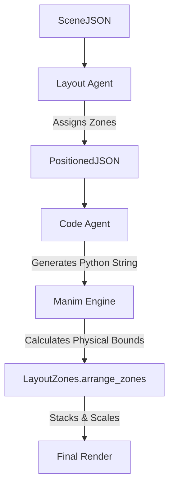
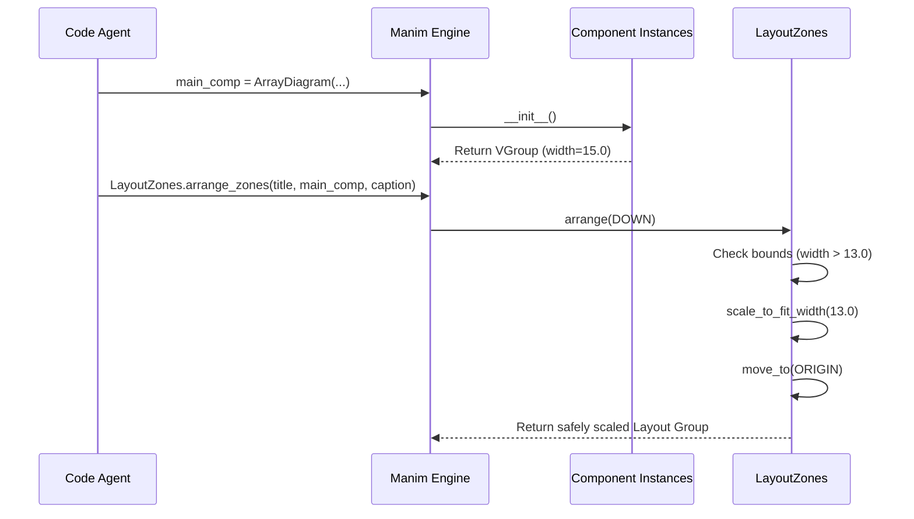

# Layout Agent Documentation

This document details the architecture of the **Layout Agent** in the Manima platform.

---

## 1. High-Level Purpose

The Layout Agent is an organizational engine responsible for translating the semantic intents of `SceneJSON` into a spatially organized format before code generation occurs.

- **Problem Solved:** LLMs are notorious for failing at precise 2D spatial math. If asked to place a title, a graph, and a caption on screen, an LLM will often generate overlapping coordinates. The Layout Agent removes coordinate math from the LLM entirely, mapping content to abstract "Zones".
- **Separation of Concerns:** By separating Layout from Code Generation, the pipeline ensures that all videos conform to a standard, accessible, and responsive visual hierarchy, regardless of what educational components the LLM requested.

---

## 2. Overall Workflow

The layout process occurs in two phases: **Logical Assignment** (in the Python agent) and **Physical Arrangement** (deferred to the Manim sandbox).

**Workflow:**
1. **SceneJSON:** Arrives containing raw semantic data (`title="Binary Search"`, `components=["ArrayDiagram"]`).
2. **Layout Agent (`layout_agent.py`):** Iterates through the data and assigns each semantic piece to a logical string tag (e.g., `"TitleZone"`).
3. **PositionedJSON:** The updated JSON is returned, now containing a `layout_zones` dictionary mapping the content to the zones.
4. **Code Agent:** Reads the `PositionedJSON` and injects these logical zones into a predefined Manim component (`LayoutZones.arrange_zones()`).
5. **Manim Engine:** At runtime, Manim calculates the physical bounding boxes of the rendered text and components, stacks them, and scales them to fit the camera safely.

---

## 3. Inputs

The Layout Agent reads the following directly from `AgentState["scene_jsons"]`:

- **`title`** (str): The main header text.
- **`caption`** (str): The explanatory footer text.
- **`components`** (List[str]): The chosen visual class (e.g., `["GraphPlot"]`).
- **`component_data`** (dict): The data payload for the component.

*Crucially, the Layout Agent receives **no physical dimensions, bounding boxes, or configuration metrics**.* It operates entirely on semantic metadata.

---

## 4. Output Schema

The Layout Agent outputs a list of `PositionedJSON` objects. It inherits every field from `SceneJSON` and appends one specific field:

| Field | Type | Purpose | Example |
|-------|------|---------|---------|
| `layout_zones` | `dict` | Maps semantic content to abstract spatial zone identifiers. | `{"title": "TitleZone", "visualization": "VisualizationZone", "explanation": "ExplanationZone"}` |

---

## 5. Layout Algorithm

The true layout decisions are split. The Python agent does the mapping, while `components.py` (inside the `LayoutZones` class) does the physical math.

**Decision Logic (`LayoutZones.arrange_zones`):**
1. **Instantiation:** The Manim engine instantiates the Mobjects (Text for title, Text for caption, and the actual Component for visualization).
2. **Arrangement:** The objects are placed in a `VGroup`. Manim's `.arrange(DOWN, buff=0.5)` is called. This automatically stacks the elements top-to-bottom (Title → Visualization → Caption) with a vertical padding (`buff`) of 0.5 units between them.
3. **Centering:** The entire stacked group is moved to the exact center of the screen using `.move_to(ORIGIN)`.
4. **Collision Prevention & Scaling:** To prevent objects from clipping off the screen, the algorithm checks the physical bounding box. The standard 16:9 camera is ~14.2 x 8.0 units.
   - If the total width exceeds `13.0`, it calls `.scale_to_fit_width(13.0)`.
   - If the total height exceeds `7.0`, it calls `.scale_to_fit_height(7.0)`.
   
This responsive algorithm guarantees that nothing ever renders off-screen.

---

## 6. Visual Hierarchy

The Layout Agent understands a strict, top-down visual hierarchy:
- **Primary Text:** Title always on top.
- **Primary Object:** Visualization always centrally located.
- **Secondary Text:** Caption always on the bottom.
- **Alignment:** All elements are strictly center-aligned.
- **White Space:** Enforced rigidly by the `buff=0.5` spacing.

**Limitations:** It does not understand complex composition rules like rule-of-thirds, asymmetrical balance, wrapping text around an object, or grouping unrelated concepts side-by-side.

---

## 7. Responsiveness

Because the layout relies on Manim's dynamic runtime scaling (`scale_to_fit_*`), it is highly responsive:

- **If the title is very long:** Manim will detect the width > 13.0 and shrink the entire scene (Title + Visualization + Caption) down so the title fits horizontally.
- **If the visualization is very large:** If an unwieldy component (like a massive Neural Network) exceeds height 7.0, the whole scene is scaled down to fit.
- **If there is no text:** The visualization is placed in the `VGroup` alone, perfectly centered on the screen, maximizing its size.

---

## 8. Educational Awareness

**The Layout Agent cannot reason about educational meaning.**

- It treats all components as a black-box `"VisualizationZone"`. 
- It does not know to place important objects closer to the center, or keep compared objects adjacent. The visual structure relies entirely on the internal implementation of the specific *Component* (e.g., `ArrayDiagram`) to arrange its own sub-elements educationally.

---

## 9. Relationship with Components

The Python Layout Agent communicates with the Component Library solely through string tags. 
- The agent does **not** know component dimensions, bounding boxes, or preferred aspect ratios.
- Component sizes are calculated *dynamically at runtime* by Manim inside the Docker sandbox, immediately before the `scale_to_fit` checks are applied.

---

## 10. Validation

Validation is handled by `app/agents/nodes/layout_validator.py`.

- **Bounds Checking:** The validator is designed to check if any objects exceed `FRAME_X` (-7.11 to 7.11) or `FRAME_Y` (-4.0 to 4.0).
- **Current Limitation:** Because the current pipeline relies on abstract zones rather than hardcoded `[x, y]` positions in the JSON, the python-side `layout_validator.py` effectively passes all scenes as safe. The true, absolute collision prevention happens in the `components.py` dynamic scaler at runtime.

---

## 11. Important Files

- **`backend/app/agents/nodes/layout_agent.py`**: The LangGraph node that assigns semantic data to layout zone strings.
- **`backend/app/sandbox/components.py` (`LayoutZones` class)**: The Manim wrapper that performs the physical arrangement, stacking, and responsiveness scaling.
- **`backend/app/agents/nodes/layout_validator.py`**: Pre-render validation attempting bounds checking.

---

## 12. Example Walkthrough

### Example: Array Sort
1. **Input (SceneJSON):**
   ```json
   {
     "title": "Sorting an Array",
     "caption": "Swapping values",
     "components": ["ArrayDiagram"],
     "component_data": {"elements": [5, 2]}
   }
   ```
2. **Logical Mapping (`layout_agent.py`):**
   ```json
   {
     "layout_zones": {
       "title": "TitleZone",
       "visualization": "VisualizationZone",
       "explanation": "ExplanationZone"
     }
   }
   ```
3. **Physical Layout (Manim Engine Runtime):**
   - Renders `Text("Sorting an Array")`.
   - Renders `ArrayDiagram([5, 2])`.
   - Renders `Text("Swapping values")`.
   - Stacks them vertically. Height is 5.0, Width is 6.0.
   - Bounds check passes (Width < 13.0, Height < 7.0).
   - Centers the group on screen.

---

## 13. Mermaid Diagrams

### Layout Data Flow


### Dynamic Sizing Sequence

