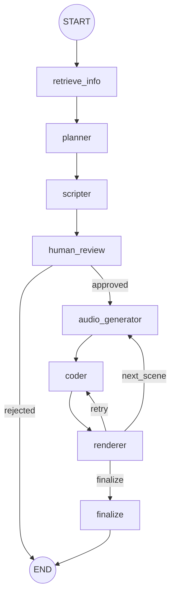
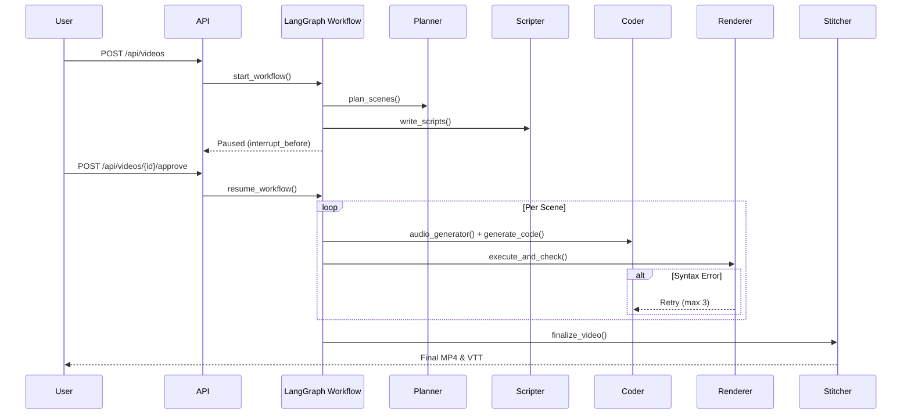

# LangGraph Multi-Agent Workflow Documentation

## 1. High-Level Overview

In this project, **LangGraph** orchestrates the multi-agent AI pipeline responsible for converting a user's prompt (e.g., a topic or concept) into a fully rendered, synchronized, educational video.

LangGraph handles the following responsibilities:
- **State Management**: Passing a single, strongly-typed state object (`AgentState`) between various independent agents and services.
- **Workflow Routing**: Defining the exact execution order, loops (e.g., scene-by-scene processing), and retry paths for transient errors.
- **Human-in-the-Loop (HITL)**: Persisting the workflow state to disk/memory and pausing execution (`interrupt_before`) so a human can review and approve AI-generated scripts before costly code generation and video rendering occur.
- **Agent Orchestration**: Coordinating specialized nodes—Planner, Scripter, Coder, Audio Generator, Renderer, and Stitcher—so each handles a distinct part of the video creation process.

## 2. Graph Structure

The entire graph is defined as a `StateGraph(AgentState)` in `app/agents/workflow.py`.

### Entry Point
- `retrieve_info` (Context Retrieval)

### Nodes
- **`retrieve_info`**: Fetches RAG context from the syllabus PDF.
- **`planner`**: Creates the structured scene plan.
- **`scripter`**: Generates narration and visual descriptions.
- **`human_review`**: Wait state for user approval.
- **`audio_generator`**: Generates TTS audio and measures duration.
- **`coder`**: Generates Manim Python code.
- **`renderer`**: Executes Manim code to produce `.mp4` video segments.
- **`finalize`**: Stitches audio, video, and VTT subtitles together.

### Edges
- `retrieve_info` -> `planner`
- `planner` -> `scripter`
- `scripter` -> `human_review`
- `audio_generator` -> `coder`
- `coder` -> `renderer`
- `finalize` -> `END`

### Conditional Edges
- **From `human_review`**: 
  - If `approved` -> `audio_generator`
  - If `rejected` -> `END`
- **From `renderer`**:
  - If `retry` (error with retries left) -> `coder`
  - If `next_scene` (more scenes remain) -> `audio_generator`
  - If `finalize` (all scenes complete) -> `finalize`

### Loops & Retry Paths
- **Scene Iteration Loop**: After a successful `renderer` execution, if there are more scenes, it loops back to `audio_generator` -> `coder` -> `renderer` for the next scene index.
- **Retry Path**: If `renderer` encounters an error and `retry_count < 3`, it routes back to `coder` to attempt generating fixed code.

### Exit Conditions
- If the human user rejects the script in `human_review`.
- When all scenes have been processed and `finalize` completes stitching.

## 3. State Object

The workflow state is defined in `app/agents/state.py` using `TypedDict`. 

### `AgentState`
- `video_id` (str, required): UUID of the Supabase video record. Written at start, read by all nodes.
- `user_prompt` (str, required): The user's input topic. Written at start, read by `retrieve_info`, `planner`.
- `syllabus_context` (str, required): RAG context. Written by `retrieve_info`, read by `planner`.
- `video_title` (str, required): Title of the video. Written by `planner`, read by `scripter`.
- `topic_breakdown` (List[str], required): Learning objectives. Written by `planner`.
- `scene_plans` (List[ScenePlan], required): Planned scene structure. Written by `planner`, read by `scripter`.
- `scripts` (List[SceneScript], required): Narration and visual descriptions. Written by `scripter`, read by `coder`, `audio_generator`, `renderer`.
- `user_approved` (bool, required): Whether scripts were approved. Written by API/resume, read by `human_review`.
- `user_feedback` (Optional[str], optional): Feedback on rejection. Written by API/resume, read by `human_review`.
- `current_scene_index` (int, required): Current scene being processed. Written by `coder` (increments), read by `audio_generator`, `coder`, `renderer`.
- `scene_audio_durations` (dict[int, float], required): Measured TTS duration per scene. Written by `audio_generator`, read by `coder`.
- `generated_codes` (List[str], required): List of all generated Manim code strings. Written by `coder`, read by `renderer`.
- `last_render_error` (Optional[str], optional): Error from execution sandbox. Written by `renderer`, read by `coder` (for retries) and workflow router.
- `retry_count` (int, required): Current retry attempt for rendering. Written by `renderer`, read by workflow router.
- `all_scenes_done` (bool, required): Flag indicating all scenes are rendered. Written by `coder` / `renderer`, read by workflow router.

### `ScenePlan`
- `scene_number` (int): Sequential index.
- `title` (str): Scene title.
- `key_concepts` (List[str]): Concepts to cover.
- `visual_type` (str): Type of visual.
- `duration_seconds` (int): Estimated length.

### `SceneScript`
- `scene_order` (int): Sequential index.
- `narration` (str): Spoken script.
- `visual_description` (str): Prompt for Manim code.
- `duration_estimate` (int): Estimated duration in seconds.

## 4. Node Documentation

### `retrieve_context_node` (`app/agents/nodes/context.py`)
- **Purpose**: Fetches syllabus context from uploaded documents using RAG.
- **Inputs**: `video_id`, `user_prompt`
- **Outputs**: `syllabus_context`
- **Important Functions**: `retrieve_context` from `rag_service.py`

### `plan_scenes` (`app/agents/nodes/planner.py`)
- **Purpose**: Generates a structured breakdown and timeline (scenes) for the video.
- **Inputs**: `video_id`, `user_prompt`, `syllabus_context`
- **Outputs**: `video_title`, `topic_breakdown`, `scene_plans`
- **Important Functions**: `_parse_json_response`, `update_video_status`
- **Prompt Used**: `PLANNER_SYSTEM_PROMPT` and `create_planner_prompt`
- **Model Used**: Configured via `create_llm("planner", temperature=0.7)`. Default expected is `llama-3.3-70b-versatile` (Groq). Uses JSON structured parsing manually via string formatting and parsing.

### `write_scripts` (`app/agents/nodes/scripter.py`)
- **Purpose**: Generates the exact narration and visual descriptions for every planned scene.
- **Inputs**: `video_id`, `scene_plans`, `video_title`
- **Outputs**: `scripts`
- **Important Functions**: `create_scene` (Saves to DB), `_parse_json_response`
- **Prompt Used**: `SCRIPTER_SYSTEM_PROMPT` and `create_scripter_prompt`
- **Model Used**: Configured via `create_llm("scripter", temperature=0.7)`. Manual JSON parsing.

### `wait_for_approval` (`app/agents/nodes/human_review.py`)
- **Purpose**: Processes the HITL resume signal. If approved, preps for coding. If rejected, fails the video.
- **Inputs**: `video_id`, `user_approved`, `user_feedback`
- **Outputs**: Resets `current_scene_index`, `retry_count`, `generated_codes`
- **Important Functions**: `update_video_status`

### `generate_audio_node` (`app/agents/nodes/audio_generator.py`)
- **Purpose**: Pre-computes the TTS `.mp3` and `.vtt` to measure exact duration.
- **Inputs**: `current_scene_index`, `scripts`, `video_id`
- **Outputs**: `scene_audio_durations`
- **Important Functions**: `generate_scene_audio` from `tts_service.py`

### `generate_code` (`app/agents/nodes/coder.py`)
- **Purpose**: Generates Python Manim code tailored precisely to the audio duration and visual description.
- **Inputs**: `video_id`, `current_scene_index`, `scripts`, `scene_audio_durations`
- **Outputs**: `generated_codes`, increments `current_scene_index`
- **Important Functions**: `clean_code_response`, `update_scene_code`
- **Prompt Used**: `CODER_SYSTEM_PROMPT` and `create_coder_prompt`
- **Model Used**: Configured via `create_llm("coder", temperature=0.2)`. 

### `execute_and_check` (`app/sandbox/renderer.py`)
- **Purpose**: Sandboxes and executes the generated Python code to render an MP4 segment via Manim.
- **Inputs**: `generated_codes`, `current_scene_index` (implicitly via list length), `video_id`, `scripts`
- **Outputs**: Uploads raw silent `.mp4` to Supabase DB. Updates `last_render_error`, `retry_count`, `all_scenes_done`.
- **Important Functions**: `ManimExecutor.execute()`

### `finalize_video` (`app/sandbox/stitcher.py`)
- **Purpose**: Downloads rendered scenes, muxes them with TTS audio, concatenates them into a final video, merges and offsets `.vtt` subtitle files, and uploads results.
- **Inputs**: `video_id`
- **Outputs**: Updates DB `final_video_url`.
- **Important Functions**: `VideoStitcher.stitch_video()`, `_merge_vtts()`

## 5. Execution Flow

1. API calls `start_workflow`, initializing `AgentState` with user prompt. Workflow hits `retrieve_info`.
2. `retrieve_info` writes `syllabus_context`.
3. `planner` generates `scene_plans` and updates `AgentState`.
4. `scripter` uses `scene_plans` to populate `scripts`. The graph pauses at the `interrupt_before=["human_review"]` node.
5. User calls `resume_workflow` via API. Execution resumes at `human_review`.
6. If approved, graph routes to `audio_generator`.
7. `audio_generator` generates `.mp3` for scene 0 and records duration.
8. `coder` uses duration to generate Manim code for scene 0. `current_scene_index` increments to 1.
9. `renderer` executes code for scene 0.
10. `route_after_render` conditionally routes back to `audio_generator` for scene 1.
11. Steps 7-10 loop until all scenes are processed.
12. `route_after_render` routes to `finalize`.
13. `finalize` builds the final artifact and workflow hits `END`.

## 6. Error Handling

- **Coder Retries**: The `coder.py` node has an internal `for attempt in range(MAX_RETRIES)` loop equipped with exponential backoff designed to handle transient provider issues (e.g., rate limits, HTTP 524, 529, 429).
- **Renderer Retries**: If the executed code fails in `renderer.py` (e.g., Manim syntax error), it sets `last_render_error` and increments `retry_count`. The graph's conditional edge routes back to `coder`. The `coder` can (if implemented) read `last_render_error` to fix its code, and tries again up to 3 times.
- **Fallback Behavior**: If RAG fails, `retrieve_info` swallows the exception and returns an empty context string. If TTS fails, `audio_generator` falls back to estimating duration based on word count (0.4s per word). If parsing JSON fails in Planner/Scripter, it throws a `ValueError` (or generates a placeholder script in Scripter) to prevent crashing the chain blindly.

## 7. Graph Visualization

## 8. File Structure

- `app/agents/workflow.py`: Graph definition, routing logic, and workflow lifecycle functions (`start_workflow`, `resume_workflow`).
- `app/agents/state.py`: Definition of `AgentState`, `SceneScript`, and `ScenePlan` TypedDicts.
- `app/agents/nodes/context.py`: RAG integration node.
- `app/agents/nodes/planner.py`: Planner LLM execution node.
- `app/agents/nodes/scripter.py`: Scripter LLM execution node.
- `app/agents/nodes/human_review.py`: State processing after HITL resume.
- `app/agents/nodes/audio_generator.py`: TTS generation and duration tracking node.
- `app/agents/nodes/coder.py`: Manim code generation node.
- `app/sandbox/renderer.py`: Local execution sandbox for rendering Manim scenes.
- `app/sandbox/stitcher.py`: FFmpeg assembly logic for video, audio, and subtitles.
- `app/agents/prompts/*.py`: Specialized system prompts and template constructors for each agent.

## 9. Dependencies

- **LLM Factory** (`app/services/llm_factory.py`): Abstracted function to instantiate `langchain` chat models dynamically using either Groq or OpenRouter, falling back to global settings if agent-specific settings are missing.
- **Supabase Client** (`app/services/supabase_client.py`): Database helpers to actively persist the generated videos, plans, scripts, and status updates as they happen inside the nodes.
- **RAG Service** (`app/services/rag_service.py`): Used by context node to embed and query vector storage.
- **TTS Service** (`app/services/tts_service.py`): Leverages `edge-tts` and `mutagen.mp3` for precise audio synthesis and time duration calculations.
- **ManimExecutor** (`app/sandbox/executor.py`): Wraps python `subprocess` / Docker to safely execute the generated Python code and capture errors/logs.

## 10. Notes

- The workflow heavily leverages Supabase for persistence. Nodes often push updates to the database (e.g. `update_video_status()`, `create_scene()`) independently of the LangGraph state. 
- The `human_review` node requires `MemorySaver()` checkpointer in LangGraph to function since `interrupt_before` halts process execution entirely until triggered externally.
- Code generation retry logic (`coder.py`) for API transient errors is isolated entirely within the `generate_code` node and does NOT iterate through the wider LangGraph edges. LangGraph's routing (`retry` edge) is reserved exclusively for handling execution/rendering errors (like Python Tracebacks from Manim).
